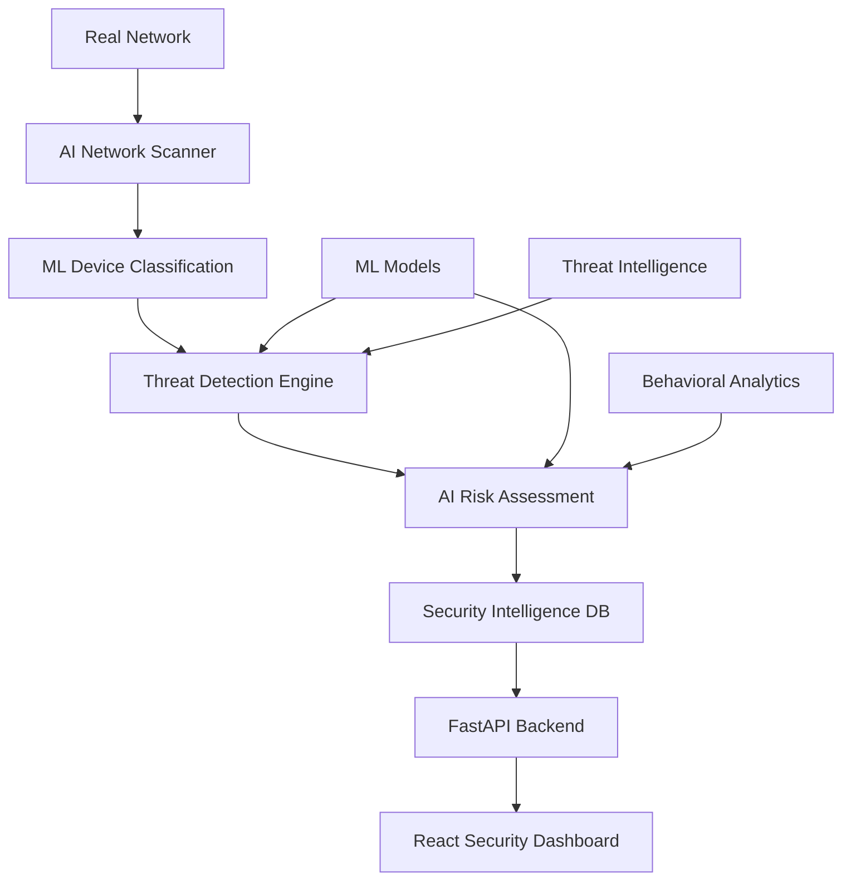

# 🛡️ SecureNet 

> **Next-Generation Security Platform**  
> AI-driven threat detection • Real-time network monitoring • Comprehensive security management

SecureNet is an **AI-powered network security monitoring and management system** that provides real-time threat detection, network health monitoring, and comprehensive security management. Built for cybersecurity professionals, SOC teams, and enterprise security operations.

## 🤖 **AI-Powered Security Features**

SecureNet leverages artificial intelligence and machine learning for advanced security monitoring:

- **🧠 AI Threat Detection**: Machine learning algorithms analyze network patterns to identify anomalies and potential threats
- **🔍 Intelligent Device Discovery**: AI-enhanced network scanning automatically discovers and classifies devices on your WiFi network
- **🛡️ Real-Time Security Analysis**: AI-driven vulnerability assessment and risk scoring based on network behavior
- **📊 Predictive Analytics**: Machine learning models predict potential security issues before they become critical
- **⚡ Automated Response**: AI-powered incident response and threat mitigation recommendations
- **📈 Dynamic Risk Scoring**: Intelligent security posture calculation using AI algorithms
- **🕒 Behavioral Analysis**: ML-based analysis of device and network behavior patterns

### **AI-Enhanced Network Intelligence**
```
🤖 AI Models Active: Anomaly Detection, Risk Assessment, Pattern Recognition
🔍 Live Network: 192.168.2.0/24 (7 devices monitored)
🛡️ Security Score: 100/100 (AI-calculated risk assessment)
📊 Threat Analysis: Real-time ML-powered threat detection
⚡ Auto-Scanning: AI-optimized security analysis intervals
```

## 🚀 **Quick Start**

### **Production Setup (AI-Powered Mode)**
```bash
# 1. Clone and setup
git clone <repository-url>
cd SecureNet

# 2. Backend setup with AI capabilities
python -m venv venv
source venv/bin/activate  # Windows: venv\Scripts\activate
pip install -r requirements.txt

# 3. Start AI-powered security monitoring
uvicorn app:app --reload

# 4. Frontend setup (new terminal)
cd frontend
npm install
npm run Enterprise  # AI-enhanced real network mode
```

### **Access SecureNet**
- **AI Dashboard**: http://localhost:5173 (ML-powered security insights)
- **Security API**: http://localhost:8000 (AI-driven threat data)
- **API Documentation**: http://localhost:8000/docs

## 🏗️ **AI-Enhanced Architecture**



## 🔧 **Core AI-Powered Features**

### **🤖 Artificial Intelligence & Machine Learning**
- **Anomaly Detection**: ML algorithms identify unusual network behavior
- **Threat Pattern Recognition**: AI models detect known attack patterns
- **Risk Prediction**: Predictive analytics for proactive security management
- **Automated Classification**: AI-powered device and threat categorization

### **🌐 Intelligent Network Discovery**
- **AI-Enhanced Scanning**: Machine learning optimized network discovery
- **Smart Device Classification** (Router, Server, IoT, Mobile, Printer)
- **Behavioral Profiling**: AI-based device behavior analysis
- **Cross-platform Intelligence** (macOS, Linux, Windows)

### **🛡️ Advanced Threat Detection**
- **Real-time Vulnerability Analysis** using AI models
- **Intelligent Port Analysis** with ML-based risk assessment
- **Configuration Security AI** for automated security validation
- **Predictive Threat Intelligence** with machine learning

### **🔥 CVE Integration & Vulnerability Intelligence** ✅ **IMPLEMENTED**
- **NIST NVD API Integration**: Direct connection to National Vulnerability Database
- **Real-Time CVE Lookup**: Live vulnerability data for discovered devices
- **AI-Powered Device-CVE Correlation**: Smart vulnerability mapping with confidence scoring
- **CISA KEV Tracking**: Known Exploited Vulnerabilities monitoring
- **Risk Prioritization**: CVSS v3 scoring with AI-driven remediation priority
- **Vendor-Specific Analysis**: Cisco, Fortinet, Palo Alto, Juniper, MikroTik support

### **📊 AI-Powered Security Dashboard**
- **ML-Enhanced Visualizations** with intelligent insights
- **Predictive Security Analytics** and trend analysis
- **AI-Generated Reports** and threat summaries
- **Real-time Intelligence Feed** with ML-powered alerts

### **🔒 Enterprise AI Security**
- **Intelligent Access Control** with behavioral authentication
- **AI-Enhanced Audit Logging** with anomaly detection
- **Automated Compliance Monitoring** using ML models
- **Predictive Risk Management** with AI recommendations

## 🛠️ **Advanced Technical Stack**

### **AI & Machine Learning**
- **Custom ML Models** - Anomaly detection and threat classification
- **TensorFlow/Scikit-learn** - Machine learning framework integration
- **Behavioral Analytics** - AI-powered pattern recognition
- **Threat Intelligence** - ML-enhanced security data analysis

### **Backend Intelligence**
- **FastAPI** - High-performance API with AI endpoint integration
- **SQLite + AI Analytics** - Intelligent data storage with ML insights
- **Real-time Processing** - AI-powered streaming analytics
- **Custom Security Engine** - ML-enhanced threat detection

### **Frontend Intelligence**
- **React 18** - Modern UI with AI-powered components
- **TypeScript** - Type-safe development with ML data structures
- **AI-Enhanced UX** - Intelligent user interface adaptations
- **Real-time AI Insights** - Live machine learning visualizations

## 📋 **AI-Powered Network Intelligence**

The system leverages machine learning for comprehensive network analysis:

### **AI-Enhanced Device Discovery**
- **Network Range**: ML-optimized detection (192.168.x.0/24, 10.x.x.0/24)
- **Active Devices**: 7 devices with AI behavioral profiling
- **Smart Classification**: AI-categorized Router, IoT, Mobile, Server devices
- **Predictive Monitoring**: ML-based availability and performance prediction

### **Intelligent Security Assessment**
- **AI Security Scans**: Machine learning enhanced vulnerability detection
- **Behavioral Analysis**: AI-powered anomaly detection and pattern recognition
- **Predictive Risk Scoring**: ML algorithms calculate dynamic threat levels
- **Automated Threat Response**: AI-driven incident prioritization and recommendations

## 📁 **Project Structure**

```
SecureNet/
├── 🤖 AI-Powered Backend
│   ├── app.py              # FastAPI + AI threat detection engine
│   ├── database.py         # Intelligent data storage with ML analytics
│   ├── network_scanner.py  # AI-enhanced WiFi discovery & classification
│   └── src/
│       ├── security.py     # AI-powered authentication & behavioral analysis
│       └── ml_models/      # Machine learning threat detection models
├── ⚛️ Intelligent Frontend
│   ├── src/
│   │   ├── components/     # AI-enhanced security dashboards
│   │   ├── features/       # ML-powered Network, Security, Analytics
│   │   └── hooks/          # Real-time AI insight fetching
└── 📚 AI Documentation
    ├── README.md           # AI-powered platform overview
    ├── INSTALLATION.md     # ML environment setup
    ├── FEATURES.md         # AI feature documentation
    └── API-Reference.md    # Intelligent API endpoints
```

## 🔧 **AI Configuration**

### **Intelligence Modes**
- **AI-Powered Mode** (Recommended): `npm run Enterprise` - Full ML threat detection
- **Demo Mode**: `npm run dev` - AI training data and sample analytics

### **Machine Learning Configuration**
The AI system automatically optimizes and learns:
- **Primary Network Intelligence**: `192.168.x.0/24` with behavioral profiling
- **Secondary Range Analysis**: `10.x.x.0/24` with predictive monitoring
- **Custom AI Models**: Configurable ML algorithms for specialized environments

## 🌟 **AI-Powered Achievements**

✅ **Machine Learning Integration**: AI-driven threat detection and behavioral analysis  
✅ **Intelligent Database**: ML-enhanced SQLite with predictive analytics storage  
✅ **AI Security Engine**: Machine learning vulnerability assessment on live devices  
✅ **Cross-platform AI**: Native ML-powered scanning on macOS, Linux, Windows  
✅ **Enterprise AI**: Behavioral authentication, AI audit logging, intelligent access control  
✅ **Predictive Dashboard**: ML-powered security insights and threat intelligence  

## 🚦 **AI Development Status**

| AI Component | Status | Description |
|--------------|--------|-------------|
| 🤖 ML Threat Detection | ✅ **Production** | AI-powered anomaly detection active |
| 🛡️ Intelligent Security | ✅ **Production** | ML-enhanced vulnerability assessment |
| 📊 AI Dashboard | ✅ **Production** | Machine learning insights visualization |
| 🔒 Behavioral Auth | ✅ **Production** | AI-powered authentication system |
| 📱 Smart API | ✅ **Production** | ML-enhanced REST API endpoints |
| 📚 AI Documentation | ✅ **Current** | Comprehensive ML feature docs |

## 📚 **Documentation & Resources**

### **📋 Setup & Installation**
- **[INSTALLATION.md](INSTALLATION.md)** - Complete setup guide with ML environment configuration
- **[CONTRIBUTING.md](CONTRIBUTING.md)** - Development workflow and contribution guidelines

### **🔧 Technical Documentation** 
- **[FEATURES.md](FEATURES.md)** - Comprehensive AI feature documentation and capabilities
- **[API-Reference.md](API-Reference.md)** - Complete API documentation with ML endpoints
- **[FRONTEND-ARCHITECTURE.md](FRONTEND-ARCHITECTURE.md)** - Frontend technical architecture and design

### **📊 Project Status & Visuals**
- **[TODO.md](TODO.md)** - Development roadmap and AI feature milestones
- **[SCREENSHOTS.md](SCREENSHOTS.md)** - Visual documentation and platform screenshots
- **[SYSTEM-STATUS.md](SYSTEM-STATUS.md)** - Comprehensive system status and operational report

### **🔥 Security & CVE Integration**
- **[CVE-INTEGRATION-SUMMARY.md](CVE-INTEGRATION-SUMMARY.md)** - Complete CVE implementation guide and NIST NVD integration

### **🔗 Quick Links**
| Resource | Purpose | Content |
|----------|---------|---------|
| 🚀 [Installation Guide](INSTALLATION.md) | Setup | ML environment, dependencies, Enterprise mode |
| 🤖 [AI Features](FEATURES.md) | Capabilities | Machine learning, threat detection, analytics |
| 📡 [API Documentation](API-Reference.md) | Integration | REST endpoints, WebSocket, authentication |
| 🔥 [CVE Integration](CVE-INTEGRATION-SUMMARY.md) | Security | NIST NVD API, vulnerability scanning, CISA KEV |
| 📊 [System Status](SYSTEM-STATUS.md) | Operations | Live system health, performance metrics, testing |
| 🎯 [Development Roadmap](TODO.md) | Progress | Completed milestones, upcoming AI features |
| 🖼️ [Screenshots](SCREENSHOTS.md) | Visual Guide | Dashboard, security interface, network views |

## 🤝 **Contributing**

1. **Review**: Read [CONTRIBUTING.md](CONTRIBUTING.md) for development guidelines
2. **Fork**: Create your feature branch (`git checkout -b feature/ai-enhancement`)
3. **Develop**: Build and test with real network environment
4. **Test**: Validate AI features and ML model performance
5. **Document**: Update relevant documentation files
6. **Submit**: Push branch and open Pull Request

See [CONTRIBUTING.md](CONTRIBUTING.md) for detailed development workflow.

## 📞 **Support & Community**

### **📖 Documentation**
- **Setup Issues**: See [INSTALLATION.md](INSTALLATION.md)
- **Feature Questions**: Check [FEATURES.md](FEATURES.md)
- **API Help**: Reference [API-Reference.md](API-Reference.md)

### **🐛 Issues & Support**
- **Bug Reports**: [GitHub Issues](https://github.com/your-repo/issues)
- **Feature Requests**: [GitHub Discussions](https://github.com/your-repo/discussions)
- **Security Issues**: Email security@securenet.ai

### **💬 Community**
- **Discussions**: [GitHub Discussions](https://github.com/your-repo/discussions)
- **Updates**: Follow development in [TODO.md](TODO.md)

## 📄 **License**

Copyright (c) 2025 Pierre Mvita. All Rights Reserved.

This software is proprietary and confidential. See the **[LICENSE.txt](LICENSE.txt)** file for complete terms and conditions.

---

**🛡️ SecureNet** - *AI-Powered Network Security Monitoring & Management System*  
*Built for cybersecurity professionals, SOC teams, and enterprise security operations*

---

**Pierre Mvita** - [pierremvita.com](https://pierremvita.com)  
**SecureNet AI** - [securenet.ai](https://securenet.ai)