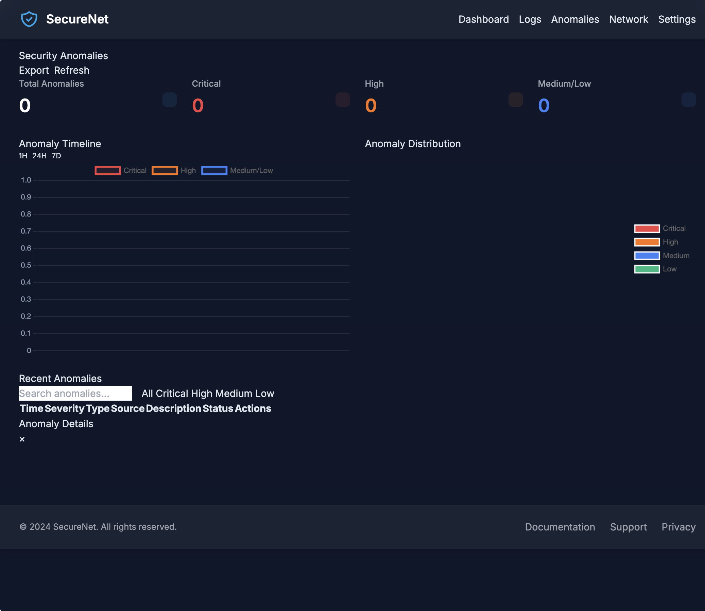
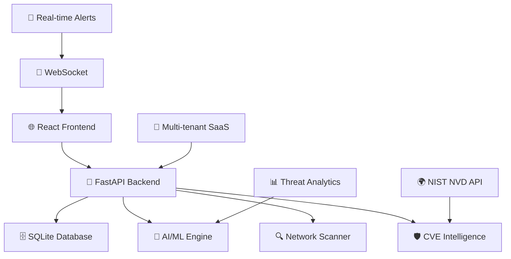

# 🛡️ SecureNet — AI-Powered Cybersecurity SaaS

> **Real-time network defense. Enterprise-grade intelligence. One dashboard.**

[](https://github.com/yourusername/securenet)
[](./INSTALLATION.md)
[](./LICENSE.txt)
[](./SYSTEM-STATUS.md)

**SecureNet** is a comprehensive AI-powered network security monitoring and management platform designed for cybersecurity professionals, SOC teams, and enterprise security operations. Built with modern SaaS architecture, it provides real-time threat detection, intelligent network discovery, and enterprise-grade security management.

---

## ⭐ **Quick Actions**

<div align="center">

[⭐ **Star this repo**](https://github.com/yourusername/securenet) • [📖 **View Documentation**](./INSTALLATION.md) • [🚀 **System Status**](./SYSTEM-STATUS.md) • [🔥 **CVE Integration**](./CVE-INTEGRATION-SUMMARY.md)

</div>

---

## 🚀 **Key Features**

<table>
<tr>
<td width="50%">

### 🧠 **AI-Powered Threat Detection**
- Machine learning anomaly detection
- Behavioral pattern recognition
- Predictive risk assessment
- Automated threat classification

### 🔍 **Live Network Discovery**
- Real-time device scanning (192.168.x.0/24)
- Smart device classification (Router, IoT, Mobile)
- Cross-platform support (macOS, Linux, Windows)
- Network topology visualization

### 🔔 **Real-Time Alert System**
- WebSocket-powered notifications
- Smart categorization & priority filtering
- Bulk operations & search functionality
- Mobile-responsive notification center

</td>
<td width="50%">

### 🔐 **Enterprise Security & RBAC**
- 3-tier role-based access control
- JWT + API key authentication
- Session tracking & audit logging
- Multi-tenant SaaS architecture

### 📊 **CVE Intelligence Integration**
- NIST NVD API connectivity
- Real-time vulnerability scoring (CVSS v3)
- CISA KEV tracking
- Vendor-specific analysis (Cisco, Fortinet, etc.)

### 📦 **SaaS Infrastructure**
- Stripe billing integration
- Organization management
- Usage analytics & metrics
- Docker deployment ready

</td>
</tr>
</table>

---

## 📸 **Platform Screenshots**

| Dashboard Overview | Log Management | Security Management |
|:------------------:|:-----------------:|:---------------:|
|  |  |  |

| Network Monitoring | Anomaly Detection | System Configuration |
|:---------------:|:----------------:|:-------------------:|
|  |  |  |

---

## 🔑 **Development Credentials**

**SecureNet includes pre-configured development users for testing role-based access:**

| Role | Username | Password | Email | Access Level |
|------|----------|----------|-------|--------------|
| 🟣 **Super Admin** | `ceo` | `superadmin123` | `ceo@securenet.ai` | Full platform access, tenant management, audit logs |
| 🔵 **Manager** | `admin` | `platform123` | `admin@secureorg.com` | Organization-level admin with advanced controls |
| 🟢 **Analyst** | `user` | `enduser123` | `user@secureorg.com` | Standard user with dashboard access |

> ⚠️ **Important**: These are development credentials only. Change them before production deployment.

---

## ⚡ **Quick Start**

### **Prerequisites**
- Python 3.8+ with pip
- Node.js 16+ with npm
- Git

### **1. Clone & Setup Backend**
```bash
git clone https://github.com/yourusername/securenet.git
cd SecureNet

# Create virtual environment
python -m venv venv
source venv/bin/activate  # Windows: venv\Scripts\activate

# Install dependencies
pip install -r requirements.txt

# Start AI-powered backend
uvicorn app:app --reload
```

### **2. Setup Frontend**
```bash
# New terminal window
cd frontend
npm install

# Start in Enterprise mode (real network scanning)
npm run Enterprise
```

### **3. Access SecureNet**
- **🎯 Dashboard**: http://localhost:5173
- **🔧 API**: http://localhost:8000
- **📚 API Docs**: http://localhost:8000/docs

---

## 🛠️ **Technology Stack**

<div align="center">


</div>

**Backend**: FastAPI • SQLite • WebSockets • JWT Auth • Pydantic • Asyncio  
**Frontend**: React 18 • TypeScript • Vite • Tailwind CSS • Heroicons • Axios  
**AI/ML**: Custom algorithms • Scikit-learn • Pattern recognition • Behavioral analytics  
**Infrastructure**: Docker • Multi-tenant SaaS • Stripe billing • Real-time processing

---

## ✅ **Enterprise Readiness Checklist**

- ✅ **Role-Based Access Control** — 3-tier security model (SuperAdmin → Manager → Analyst)
- ✅ **CVE Integration** — Real-time NIST NVD API with CISA KEV tracking
- ✅ **SaaS Billing** — Stripe integration with subscription management
- ✅ **Audit Logging** — Comprehensive activity tracking and compliance
- ✅ **Predictive Analytics** — AI-driven threat detection and risk assessment
- ✅ **Multi-Tenant Architecture** — Organization isolation and management
- ✅ **Real-Time Monitoring** — WebSocket alerts and live data streaming
- ✅ **API-First Design** — RESTful endpoints with comprehensive documentation
- ✅ **Docker Support** — Containerized deployment and scaling
- ✅ **Security Hardening** — JWT authentication, API keys, session management

---

## 📚 **Documentation Hub**

| Documentation | Description | Status |
|---------------|-------------|--------|
| **[📋 Installation Guide](./INSTALLATION.md)** | Complete setup instructions for backend + frontend | ✅ Ready |
| **[🤖 AI Features](./FEATURES.md)** | ML threat detection, predictive analytics, behavioral analysis | ✅ Ready |
| **[📡 API Reference](./API-Reference.md)** | REST endpoints, WebSocket connections, authentication | ✅ Ready |
| **[🔥 CVE Integration](./CVE-INTEGRATION-SUMMARY.md)** | NIST NVD API sync, vulnerability scoring, CISA KEV | ✅ Ready |
| **[📊 System Status](./SYSTEM-STATUS.md)** | Operational metrics, performance data, uptime monitoring | ✅ Ready |
| **[🎯 Development Roadmap](./TODO.md)** | Feature milestones, upcoming AI enhancements | ✅ Ready |
| **[🖼️ Screenshots](./SCREENSHOTS.md)** | Visual documentation, dashboard views, interface guide | ✅ Ready |
| **[🏗️ Frontend Architecture](./FRONTEND-ARCHITECTURE.md)** | Component structure, design system, technical details | ✅ Ready |

---

## 🏗️ **Architecture Overview**



**Core Components:**
- **AI-Powered Backend**: FastAPI with ML threat detection engine
- **Intelligent Frontend**: React 18 with TypeScript and real-time updates
- **Security Engine**: Custom vulnerability assessment and risk scoring
- **Network Discovery**: Cross-platform device scanning and classification
- **SaaS Infrastructure**: Multi-tenant architecture with billing integration

---

## 🚦 **Development Status**

| Component | Status | Description |
|-----------|--------|-------------|
| 🤖 **ML Threat Detection** | ✅ **Production** | AI-powered anomaly detection and behavioral analysis |
| 🛡️ **Security Intelligence** | ✅ **Production** | CVE integration with NIST NVD and vulnerability scoring |
| 📊 **Analytics Dashboard** | ✅ **Production** | Real-time security metrics and threat visualization |
| 🔔 **Notification System** | ✅ **Production** | WebSocket alerts with smart categorization |
| 🔒 **Enterprise Auth** | ✅ **Production** | JWT + API key authentication with RBAC |
| 📱 **Responsive UI** | ✅ **Production** | Modern interface with mobile support |
| 📦 **SaaS Infrastructure** | ✅ **Production** | Multi-tenant architecture with billing |
| 📚 **Documentation** | ✅ **Complete** | Comprehensive guides and API reference |

---

## 🤝 **Contributing**

We welcome contributions to SecureNet! Here's how to get started:

1. **📖 Read**: Review our [Contributing Guidelines](./CONTRIBUTING.md)
2. **🍴 Fork**: Create your feature branch (`git checkout -b feature/ai-enhancement`)
3. **🔨 Develop**: Build and test with real network environment
4. **✅ Test**: Validate AI features and ML model performance
5. **📝 Document**: Update relevant documentation files
6. **🚀 Submit**: Push branch and open a Pull Request

See [CONTRIBUTING.md](./CONTRIBUTING.md) for detailed development workflow and coding standards.

---

## 📞 **Support & Community**

### **📖 Getting Help**
- **Setup Issues**: See [Installation Guide](./INSTALLATION.md)
- **Feature Questions**: Check [Features Documentation](./FEATURES.md)
- **API Help**: Reference [API Documentation](./API-Reference.md)
- **System Status**: Monitor [Operational Metrics](./SYSTEM-STATUS.md)

### **🐛 Issues & Feedback**
- **Bug Reports**: [GitHub Issues](https://github.com/yourusername/securenet/issues)
- **Feature Requests**: [GitHub Discussions](https://github.com/yourusername/securenet/discussions)
- **Security Issues**: Email security@securenet.ai

### **💬 Community**
- **Discussions**: [GitHub Discussions](https://github.com/yourusername/securenet/discussions)
- **Updates**: Follow development in [Roadmap](./TODO.md)
- **Documentation**: Contribute to [docs improvement](./CONTRIBUTING.md)

---

## 📄 **License**

**Copyright (c) 2025 Pierre Mvita. All Rights Reserved.**

This software is proprietary and confidential. See the [LICENSE.txt](./LICENSE.txt) file for complete terms and conditions.

---

<div align="center">

**🛡️ SecureNet** — *AI-Powered Network Security Monitoring & Management*

Built for cybersecurity professionals, SOC teams, and enterprise security operations

---

**Pierre Mvita** • [pierremvita.com](https://pierremvita.com) • [SecureNet.ai](https://securenet.ai)

*Transforming cybersecurity through artificial intelligence*

</div>