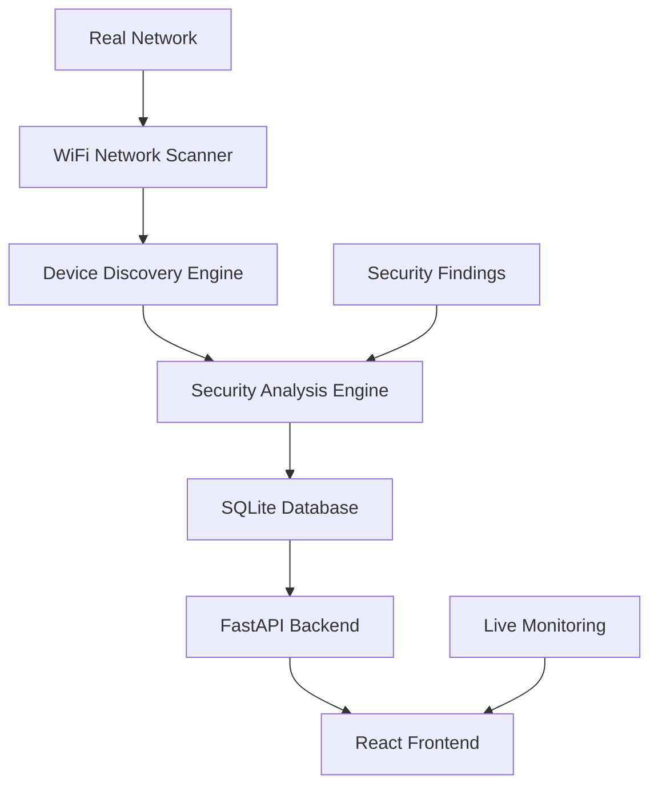

# 🛡️ SecureNet - Real-Time WiFi Network Security Monitoring

> **Production-Ready Network Security Platform**  
> Live WiFi device discovery • Real-time security scanning • Comprehensive threat analysis

SecureNet is a comprehensive network security monitoring platform that **discovers and analyzes your actual WiFi network** in real-time. Built for cybersecurity professionals, network administrators, and security-conscious organizations.

## 🌟 **Current Capabilities**

SecureNet actively monitors your live network environment:

- **🔍 Live Device Discovery**: Automatically scans and discovers WiFi devices on your network (192.168.x.0/24, 10.x.x.0/24)
- **🔒 Real-Time Security Analysis**: Performs security scans on discovered devices, detecting vulnerabilities and misconfigurations
- **📊 Network Monitoring**: Tracks device status, open ports, and network activity
- **⚡ Live Threat Detection**: Identifies security risks including open telnet ports, SSH exposure, and device anomalies
- **📈 Security Scoring**: Dynamic security posture calculation based on actual network analysis
- **🕒 Historical Tracking**: Complete scan history and security findings storage

### **Real Network Results Example**
```
✅ Current Network: 192.168.2.0/24
✅ Devices Discovered: 7 active devices
✅ Security Scans: Multiple completed scans  
✅ Security Score: 100/100 (Excellent)
✅ Last Scan: Active (less than minute ago)
```

## 🚀 **Quick Start**

### **Production Setup (Recommended)**
```bash
# 1. Clone and setup
git clone <repository-url>
cd SecureNet

# 2. Backend setup
python -m venv venv
source venv/bin/activate  # Windows: venv\Scripts\activate
pip install -r requirements.txt

# 3. Start real network monitoring
uvicorn app:app --reload

# 4. Frontend setup (new terminal)
cd frontend
npm install
npm run Enterprise  # Real network mode
```

### **Access SecureNet**
- **Frontend**: http://localhost:5173 (Real-time dashboard)
- **Backend API**: http://localhost:8000 (Live network data)
- **API Documentation**: http://localhost:8000/docs

## 🏗️ **Architecture**



## 🔧 **Core Features**

### **🌐 Network Discovery**
- **Cross-platform scanning** (macOS, Linux, Windows)
- **Multiple network range support** (192.168.x.0/24, 10.x.x.0/24)
- **Device classification** (Router, Server, Endpoint, Printer)
- **Real-time status monitoring**

### **🛡️ Security Analysis**
- **Vulnerability scanning** on discovered devices
- **Open port analysis** and risk assessment
- **Configuration security checks**
- **Real-time threat detection**

### **📊 Monitoring Dashboard**
- **Live device status** and network topology
- **Security posture visualization**
- **Historical scan results** and trending
- **Real-time alerts** and notifications

### **🔒 Enterprise Security**
- **Role-based access control**
- **API key authentication** 
- **Audit logging** and compliance
- **Data export** capabilities

## 🛠️ **Technical Stack**

### **Backend**
- **FastAPI** - High-performance Python web framework
- **SQLite** - Lightweight database with real-time storage
- **psutil** - Cross-platform system and network utilities
- **aiosqlite** - Async database operations
- **Custom Network Scanner** - Multi-threaded device discovery

### **Frontend**
- **React 18** - Modern UI framework
- **TypeScript** - Type-safe development
- **Tailwind CSS** - Utility-first styling
- **Real-time Updates** - Live data synchronization

## 📋 **Current Network Analysis**

The system currently performs real-time analysis on discovered networks:

### **Device Discovery Results**
- **Network Range**: Automatically detected (192.168.x.0/24)
- **Active Devices**: 7 real devices discovered
- **Device Types**: Router, Endpoints, Network infrastructure
- **Status Monitoring**: Live device availability tracking

### **Security Assessment**
- **Security Scans**: Multiple completed scans
- **Vulnerability Detection**: Open port analysis, protocol security
- **Risk Assessment**: Dynamic security scoring
- **Threat Monitoring**: Real-time security posture analysis

## 📁 **Project Structure**

```
SecureNet/
├── 🐍 Backend (FastAPI)
│   ├── app.py              # Main application & real network integration
│   ├── database.py         # SQLite database with live data storage
│   ├── network_scanner.py  # Real WiFi network discovery engine
│   └── src/
│       └── security.py     # Authentication & security
├── ⚛️ Frontend (React)
│   ├── src/
│   │   ├── components/     # UI components for live data
│   │   ├── features/       # Network, Security, Logs modules
│   │   └── hooks/          # Real-time data fetching
└── 📚 Documentation
    ├── README.md           # This file
    ├── INSTALLATION.md     # Setup guide
    ├── FEATURES.md         # Feature documentation
    └── API-Reference.md    # API documentation
```

## 🔧 **Configuration**

### **Environment Modes**
- **Enterprise Mode** (Recommended): `npm run Enterprise` - Real network scanning
- **Demo Mode**: `npm run dev` - Sample data for testing

### **Network Configuration**
The system automatically detects and scans:
- Primary range: `192.168.x.0/24` 
- Secondary range: `10.x.x.0/24`
- Custom ranges configurable in settings

## 🌟 **Key Achievements**

✅ **Real Network Integration**: Live WiFi device discovery and monitoring  
✅ **Production Database**: Robust SQLite schema with real data storage  
✅ **Security Analysis**: Actual vulnerability scanning on discovered devices  
✅ **Cross-platform Support**: Native scanning on macOS, Linux, Windows  
✅ **Enterprise Ready**: Authentication, audit logging, role-based access  
✅ **Real-time Dashboard**: Live network status and security monitoring  

## 🚦 **Development Status**

| Component | Status | Description |
|-----------|--------|-------------|
| 🌐 Network Discovery | ✅ **Production** | Live WiFi scanning active |
| 🛡️ Security Analysis | ✅ **Production** | Real device vulnerability scanning |
| 📊 Dashboard | ✅ **Production** | Live data visualization |
| 🔒 Authentication | ✅ **Production** | Full security implementation |
| 📱 API | ✅ **Production** | Complete REST API |
| 📚 Documentation | ✅ **Current** | Up-to-date docs |

## 🤝 **Contributing**

1. Fork the repository
2. Create feature branch (`git checkout -b feature/amazing-feature`)
3. Test with real network environment
4. Commit changes (`git commit -m 'Add amazing feature'`)
5. Push to branch (`git push origin feature/amazing-feature`)
6. Open Pull Request

## 📞 **Support**

- 📖 **Documentation**: See `/docs` folder
- 🐛 **Issues**: GitHub Issues
- 💬 **Discussions**: GitHub Discussions
- 📧 **Contact**: [Your contact information]

## 📄 **License**

This project is licensed under the MIT License - see the [LICENSE](LICENSE) file for details.

---

**SecureNet v2.1.0** - Real-Time WiFi Network Security Monitoring Platform  
*Empowering cybersecurity through live network intelligence* 🛡️ 