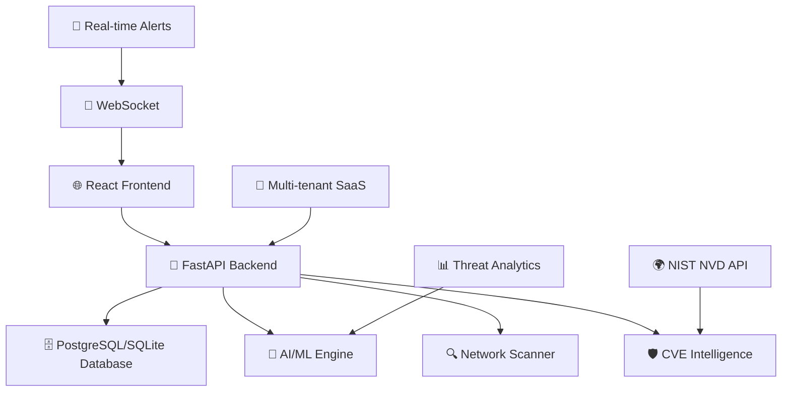

# 🛡️ SecureNet

> **Real-time network defense. Enterprise-grade intelligence. One dashboard.**

[](https://github.com/yourusername/securenet)
[](./docs/installation/INSTALLATION.md)
[](./LICENSE.txt)
[](./docs/system/SYSTEM-STATUS.md)
[](./docs/compliance/soc2-readiness.md)
[](./docs/compliance/security-hardening.md)

**SecureNet** is an enterprise-grade AI-powered cybersecurity platform delivering autonomous threat detection, predictive risk assessment, and intelligent security operations management. Engineered for Fortune 500 enterprises, government agencies, and managed security service providers (MSSPs), SecureNet combines advanced machine learning algorithms with real-time network intelligence to provide comprehensive security posture management and compliance automation.

---

## ⭐ **Quick Actions**

<div align="center">

[⭐ **Star this repo**](https://github.com/yourusername/securenet) • [📖 **View Documentation**](./docs/installation/INSTALLATION.md) • [🚀 **System Status**](./docs/system/SYSTEM-STATUS.md) • [🔥 **CVE Integration**](./docs/features/CVE-INTEGRATION-SUMMARY.md)

</div>

---

## 🚀 **Key Features**

<table>
<tr>
<td width="50%">

### 🧠 **AI-Powered Threat Detection**
- Machine learning anomaly detection
- Behavioral pattern recognition
- Predictive risk assessment
- Automated threat classification

### 🔍 **Live Network Discovery**
- Real-time device scanning (192.168.x.0/24)
- Smart device classification (Router, IoT, Mobile)
- Cross-platform support (macOS, Linux, Windows)
- Network topology visualization

### 🔔 **Real-Time Alert System**
- WebSocket-powered notifications
- Smart categorization & priority filtering
- Bulk operations & search functionality
- Mobile-responsive notification center

</td>
<td width="50%">

### 🔐 **Enterprise Security & RBAC**
- 3-tier role-based access control
- JWT + API key authentication
- Session tracking & audit logging
- Multi-tenant SaaS architecture

### 📊 **CVE Intelligence Integration**
- NIST NVD API connectivity
- Real-time vulnerability scoring (CVSS v3)
- CISA KEV tracking
- Vendor-specific analysis (Cisco, Fortinet, etc.)

### 📦 **SaaS Infrastructure**
- Stripe billing integration
- Organization management
- Usage analytics & metrics
- Docker deployment ready

</td>
</tr>
</table>

---

## 📸 **Platform Screenshots**

*Enterprise-Grade Security Operations Center Interface*

| Dashboard Overview | Log Management | Security Management |
|:------------------:|:-----------------:|:---------------:|
|  |  |  |

| Network Monitoring | Anomaly Detection | System Configuration |
|:---------------:|:----------------:|:-------------------:|
|  |  |  |

> **Note**: Screenshots demonstrate production-ready interface with enterprise security features. For complete visual documentation, see [Screenshots Guide](./docs/SCREENSHOTS.md).

---

## 🔑 **Development Credentials**

**SecureNet includes pre-configured development users for testing role-based access:**

| Role | Username | Password | Email | Access Level |
|------|----------|----------|-------|--------------|
| 🟣 **Platform Owner** | `ceo` | `superadmin123` | `ceo@securenet.ai` | Full platform access, tenant management, audit logs |
| 🔵 **Security Admin** | `admin` | `platform123` | `admin@secureorg.com` | Organization-level admin with advanced controls |
| 🟢 **SOC Analyst** | `user` | `enduser123` | `user@secureorg.com` | Standard user with dashboard access |

> ⚠️ **Important**: These are development credentials only. Change them before production deployment.

---

## ⚡ **Quick Start**

### **Prerequisites**
- Python 3.8+ with pip
- Node.js 16+ with npm
- PostgreSQL 13+ (for enterprise features) or SQLite (development)
- Redis (for enhanced features)
- Git

### **1. Clone & Setup Backend**
```bash
git clone https://github.com/pmvita/securenet.git
cd SecureNet

# Create virtual environment
python -m venv venv
source venv/bin/activate  # Windows: venv\Scripts\activate

# Install dependencies
# For development (SQLite):
pip install -r requirements.txt

# For enterprise (PostgreSQL + full features):
pip install -r requirements-enterprise.txt
```

### **2. Database Setup**

#### **🏢 Enterprise (PostgreSQL)**
```bash
# Install PostgreSQL (macOS)
brew install postgresql
brew services start postgresql

# Install and setup PostgreSQL
brew install postgresql                    # macOS
sudo apt-get install postgresql          # Ubuntu/Debian
brew services start postgresql           # macOS
sudo systemctl start postgresql          # Linux

# Create database and user
createdb securenet
createuser -s securenet
psql -c "ALTER USER securenet PASSWORD 'securenet';"

# Run migration to PostgreSQL
python scripts/migrate_to_postgresql.py
```

#### **🛠 Development (SQLite)**
```bash
# SQLite database will be created automatically at data/securenet.db
# No additional setup required
```

### **3. Start Backend Server**

#### **🚀 Production Mode (Recommended)**
```bash
# Complete production environment (backend + frontend)
./start_production.sh         # Full production setup with security checks

# Alternative: Manual production startup
python start_backend.py --prod --check

# Stop production services
./stop_production.sh          # Clean shutdown
```

#### **🔍 Production Validation**
```bash
# Validate production readiness
python scripts/ops/test_production_boot.py

# Expected output: ✅ ALL VALIDATIONS PASSED (5/5)
```

- **📚 Complete Setup**: See [Startup Guide](./docs/setup/STARTUP_GUIDE.md) for comprehensive deployment instructions
- **🏢 Enterprise Deployment**: See [Production Configuration](./docs/setup/production_config.txt) for enterprise environment setup
- **🔧 Enhanced Features**: See [Enhanced Version Guide](./docs/setup/ENHANCED_VERSION_GUIDE.md) for advanced monitoring & ML capabilities

### **4. Setup Frontend**
```bash
# New terminal window
cd frontend
npm install

# Build for production
npm run build

# Start production preview
npm run preview

# Alternative: Development mode with mock data
npm run dev
```

### **5. Access SecureNet**
- **🎯 Dashboard**: http://localhost:5173
- **🔧 API**: http://localhost:8000
- **📚 API Docs**: http://localhost:8000/docs
- **📊 Enhanced Metrics**: http://localhost:8000/system/health (enhanced version only)

---

## 🛠️ **Technology Stack**

<div align="center">


</div>

**Backend**: FastAPI • PostgreSQL/SQLite • WebSockets • JWT Auth • Pydantic • Asyncio  
**Frontend**: React 18 • TypeScript • Vite • Tailwind CSS • Heroicons • Axios  
**AI/ML**: Custom algorithms • Scikit-learn • MLflow • Pattern recognition • Behavioral analytics  
**Enhanced**: Redis • RQ • Sentry • Prometheus • Structured logging • Cryptography  
**Infrastructure**: Docker • Kubernetes • Multi-tenant SaaS • Stripe billing • Real-time processing

---

## ✅ **Enterprise Readiness Checklist**

- ✅ **Role-Based Access Control** — 3-tier security model (Platform Owner → Security Admin → SOC Analyst)
- ✅ **CVE Integration** — Real-time NIST NVD API with CISA KEV tracking
- ✅ **SaaS Billing** — Stripe integration with subscription management
- ✅ **Audit Logging** — Comprehensive activity tracking and compliance
- ✅ **Predictive Analytics** — AI-driven threat detection and risk assessment
- ✅ **Multi-Tenant Architecture** — Organization isolation and management
- ✅ **Real-Time Monitoring** — WebSocket alerts and live data streaming
- ✅ **API-First Design** — RESTful endpoints with comprehensive documentation
- ✅ **Docker Support** — Containerized deployment and scaling
- ✅ **Security Hardening** — JWT authentication, API keys, session management

---

## 🧩 **SecureNet Enhanced Architecture**

SecureNet now offers **two deployment options** to meet different operational needs:

### **🏭 Original SecureNet (`app.py`)**
- ✅ **Production-ready** and battle-tested
- ✅ **Full feature set** with real-time monitoring
- ✅ **Stable architecture** for enterprise deployment
- ✅ **Compatible** with existing frontend and workflows

### **🚀 Enhanced SecureNet (`app_enhanced.py`)**
- ✅ **All original features** PLUS advanced capabilities
- 📊 **Prometheus metrics** and structured logging
- 🔍 **Sentry error monitoring** and distributed tracing
- 🤖 **MLflow experiment tracking** and model management
- ⚡ **Redis task queues** for background processing
- 🔐 **Advanced cryptography** and security services

> **Seamless Migration**: Both versions use the same database and frontend - switch anytime!

---

## 📁 **Technical Integration Guides**

### **🏗️ Backend Integration**
- [🚀 Startup Guide](./docs/setup/STARTUP_GUIDE.md) - Complete setup instructions for both versions
- [🔧 Production Configuration](./docs/setup/production_config.txt) - Environment setup template
- [🔒 Production Setup](./docs/setup/DEV_MODE_DISABLED.md) - Production mode configuration and security
- [⚡ Production Quick Reference](./docs/setup/PRODUCTION_QUICK_REFERENCE.md) - Fast production deployment commands
- [Phase 1: Observability](./docs/integration/phase-1-observability.md) - Monitoring and logging
- [Phase 2: Developer Experience](./docs/integration/phase-2-developer-experience.md) - Testing and ML tools
- [Phase 3: Advanced Tooling](./docs/integration/phase-3-advanced-tooling.md) - Cryptography and task queues

### **🎨 Frontend Integration**
- [🎨 Frontend Integration Hub](./docs/integration/frontend/README.md) - frontend enhancement roadmap
- ✅ [🚀 Phase 1: Immediate Enhancements](./docs/integration/frontend/phase-1-frontend-enhancements.md) - **COMPLETE** - Performance & reliability improvements
- ✅ [📊 Phase 2: UI & Visualization](./docs/integration/frontend/phase-2-ui-visualization.md) - **COMPLETE** - Advanced analytics & user experience
- ✅ [🏢 Phase 3: Enterprise Components](./docs/integration/frontend/phase-3-enterprise-components.md) - **COMPLETE** - Enterprise-grade development tools

---

## 📚 **Documentation Hub**

> **📖 Complete Documentation**: [docs/README.md](./docs/README.md) - Comprehensive documentation index

### **🏁 Quick Start Documentation**
| Documentation | Description | Status |
|---------------|-------------|--------|
| **[📖 Installation Guide](./docs/installation/INSTALLATION.md)** | Complete setup instructions for backend + frontend | ✅ Ready |
| **[🚀 Startup Guide](./docs/setup/STARTUP_GUIDE.md)** | Complete instructions for both original and enhanced versions | ✅ Ready |
| **[🗄️ PostgreSQL Setup](./docs/setup/POSTGRESQL_SETUP.md)** | Comprehensive PostgreSQL installation and configuration guide | ✅ Ready |
| **[🔧 Production Config](./docs/setup/production_config.txt)** | Environment configuration template and setup guide | ✅ Ready |

### **🏆 Enterprise & Certification**
| Documentation | Description | Status |
|---------------|-------------|--------|
| **[🏆 Enterprise Certification](./docs/certification/ENTERPRISE_CERTIFICATION.md)** | Official certification document (SN-ENT-2024-001) | ✅ Certified |
| **[📋 Final Audit Report](./docs/audit/FINAL_AUDIT_REPORT.md)** | Complete audit results (100% score) | ✅ Ready |
| **[🚀 Release Notes v2.2.0-enterprise](./docs/release/RELEASE_NOTES_v2.2.0-enterprise.md)** | Latest release details and features | ✅ Ready |
| **[📊 GitHub Release Summary](./docs/release/GITHUB_RELEASE_SUMMARY.md)** | GitHub release content | ✅ Ready |

### **🔐 Security & Compliance**
| Documentation | Description | Status |
|---------------|-------------|--------|
| **[🛡️ Security Features](./docs/features/FEATURES.md)** | ML threat detection, predictive analytics, behavioral analysis | ✅ Ready |
| **[🔒 Compliance Frameworks](./docs/compliance/COMPLIANCE_FRAMEWORKS.md)** | SOC 2, ISO 27001, GDPR, NIST, FedRAMP compliance details | ✅ Ready |
| **[🔥 CVE Integration](./docs/features/CVE-INTEGRATION-SUMMARY.md)** | NIST NVD API sync, vulnerability scoring, CISA KEV | ✅ Ready |

### **🏗️ Architecture & Development**
| Documentation | Description | Status |
|---------------|-------------|--------|
| **[🏗️ Frontend Architecture](./docs/architecture/FRONTEND-ARCHITECTURE.md)** | Component structure, design system, technical details | ✅ Ready |
| **[📡 API Reference](./docs/api/API-Reference.md)** | REST endpoints, WebSocket connections, authentication | ✅ Ready |
| **[🤝 Contributing Guide](./docs/contributing/CONTRIBUTING.md)** | Contribution guidelines and development workflow | ✅ Ready |
| **[📋 Changelog](./docs/project/CHANGELOG.md)** | Version history and release notes | ✅ Ready |

### **🔧 Operations & Monitoring**
| Documentation | Description | Status |
|---------------|-------------|--------|
| **[📊 System Status](./docs/system/SYSTEM-STATUS.md)** | Operational metrics, performance data, uptime monitoring | ✅ Ready |
| **[⚡ Enhanced Features](./docs/reference/ENHANCED_FEATURES.md)** | Feature comparison and enhanced capabilities reference | ✅ Ready |
| **[🗄️ Database Migration](./docs/migration/POSTGRESQL_MIGRATION_SUMMARY.md)** | Database migration and setup guide | ✅ Ready |

### **🏢 Enterprise Documentation**
| Documentation | Description | Status |
|---------------|-------------|--------|
| **[🏢 Enterprise Audit Report](./docs/enterprise/ENTERPRISE-AUDIT-REPORT.md)** | Enterprise audit details and assessment | ✅ Ready |
| **[📋 Enterprise Readiness Summary](./docs/enterprise/ENTERPRISE-READINESS-SUMMARY.md)** | Readiness assessment for enterprise deployment | ✅ Ready |
| **[🚀 Development Roadmap](./docs/project/DEVELOPMENT_ROADMAP.md)** | Complete 3-phase development cycle and future plans | ✅ Ready |
| **[👥 Project Governance](./docs/project/PROJECT_GOVERNANCE.md)** | Ownership, licensing, IP portfolio, and corporate structure | ✅ Ready |

### **🧪 Audit & Validation Reports**
| Documentation | Description | Status |
|---------------|-------------|--------|
| **[🔍 Final Hardening Audit](./docs/audit/FINAL_HARDENING_AUDIT_REPORT.md)** | Security hardening validation results | ✅ Ready |
| **[⚡ Runtime Validation Report](./docs/audit/RUNTIME_VALIDATION_REPORT.md)** | Runtime performance and validation | ✅ Ready |
| **[🛡️ System Integrity Report](./docs/audit/SYSTEM_INTEGRITY_REPORT.md)** | System integrity and security validation | ✅ Ready |
| **[📋 Post-Resolution Audit](./docs/audit/POST_RESOLUTION_AUDIT_REPORT.md)** | Post-resolution audit and verification | ✅ Ready |

### **🎨 Visual & Integration Guides**
| Documentation | Description | Status |
|---------------|-------------|--------|
| **[🖼️ Screenshots](./docs/SCREENSHOTS.md)** | Visual documentation, dashboard views, interface guide | ✅ Ready |
| **[🔧 Integration Docs](./docs/integration/)** | Phase-based library integration guides and tooling | ✅ Ready |
| **[🎨 Frontend Integration Hub](./docs/integration/frontend/README.md)** | Frontend enhancement roadmap and guides | ✅ Ready |

---

### **📁 Complete Documentation Structure**

```
docs/
├── 📖 README.md                     # Documentation hub and index
├── 🏆 certification/               # Official certification documents
├── 📋 audit/                       # Audit reports and validation
├── 🚀 release/                     # Release notes and summaries
├── 🏢 enterprise/                  # Enterprise-specific documentation
├── 🗄️ migration/                   # Database migration guides
├── 📦 setup/                       # Installation and setup guides
├── 🏗️ architecture/                # System architecture documentation
├── 📡 api/                         # API reference and guides
├── 🛡️ features/                    # Feature documentation
├── 🔒 compliance/                  # Security and compliance guides
├── 📊 system/                      # System status and monitoring
├── 🧪 testing/                     # Testing procedures and guides
├── 🤝 contributing/                # Contribution guidelines
├── 📋 project/                     # Project management and governance
└── 🔧 integration/                 # Integration guides and tooling
```

> **💡 Tip**: Start with the [Documentation Hub](./docs/README.md) for a complete overview of all available documentation.

---

## 🏗️ **Architecture Overview**



**Core Components:**
- **AI-Powered Backend**: FastAPI with ML threat detection engine
- **Intelligent Frontend**: React 18 with TypeScript and real-time updates
- **Security Engine**: Custom vulnerability assessment and risk scoring
- **Network Discovery**: Cross-platform device scanning and classification
- **SaaS Infrastructure**: Multi-tenant architecture with billing integration

---

## ☁️ **Deployment & Hosting Options**

SecureNet supports multiple deployment environments to meet diverse organizational requirements:

### **🏢 On-Premise**
- **Air-gapped environments** with complete offline operation
- **Classified-ready** deployment for government and defense contracts
- **SCIF-compatible** secure hosting for sensitive compartmented information
- **Hardware security module (HSM)** integration for cryptographic operations

### **☁️ Public Cloud**
- **Amazon Web Services (AWS)** - EC2, ECS, EKS deployment options
- **Microsoft Azure** - Container Instances, AKS, Virtual Machines
- **Google Cloud Platform (GCP)** - Compute Engine, GKE, Cloud Run
- **Multi-cloud redundancy** for high availability and disaster recovery

### **🔄 Hybrid Cloud**
- **SOC/Compliance zone** support with data residency controls
- **Edge deployment** for distributed security operations
- **Private cloud integration** with VMware vSphere, OpenStack
- **Seamless data synchronization** between on-premise and cloud components

### **🔒 SCIF-Ready Secure Hosting**
- **TS/SCI clearance** environment compatibility
- **TEMPEST-certified** hardware deployment options
- **Cross-domain solutions (CDS)** integration capability
- **FISMA High/Moderate** authorization boundary support

---

## 🚦 **Development Status**

| Component | Status | Description |
|-----------|--------|-------------|
| 🤖 **ML Threat Detection** | ✅ **Production** | AI-powered anomaly detection and behavioral analysis |
| 🛡️ **Security Intelligence** | ✅ **Production** | CVE integration with NIST NVD and vulnerability scoring |
| 📊 **Analytics Dashboard** | ✅ **Production** | Real-time security metrics and threat visualization |
| 🔔 **Notification System** | ✅ **Production** | WebSocket alerts with smart categorization |
| 🔒 **Enterprise Auth** | ✅ **Production** | JWT + API key authentication with RBAC |
| 📱 **Responsive UI** | ✅ **Production** | Modern interface with mobile support |
| 📦 **SaaS Infrastructure** | ✅ **Production** | Multi-tenant architecture with billing |
| 📚 **Documentation** | ✅ **Complete** | Comprehensive guides and API reference |

---

## 🤝 **Contributing**

We welcome contributions to SecureNet! Here's how to get started:

1. **📖 Read**: Review our [Contributing Guidelines](./CONTRIBUTING.md)
2. **🍴 Fork**: Create your feature branch (`git checkout -b feature/ai-enhancement`)
3. **🔨 Develop**: Build and test with real network environment
4. **✅ Test**: Validate AI features and ML model performance
5. **📝 Document**: Update relevant documentation files
6. **🚀 Submit**: Push branch and open a Pull Request

See [CONTRIBUTING.md](./CONTRIBUTING.md) for detailed development workflow and coding standards.

---

## 📞 **Support & Community**

### **📖 Getting Help**
- **Setup Issues**: See [Installation Guide](./docs/installation/INSTALLATION.md)
- **Feature Questions**: Check [Features Documentation](./docs/features/FEATURES.md)
- **API Help**: Reference [API Documentation](./docs/api/API-Reference.md)
- **System Status**: Monitor [Operational Metrics](./docs/system/SYSTEM-STATUS.md)

### **🐛 Issues & Feedback**
- **Bug Reports**: [GitHub Issues](https://github.com/yourusername/securenet/issues)
- **Feature Requests**: [GitHub Discussions](https://github.com/yourusername/securenet/discussions)
- **Security Issues**: Email security@securenet.ai

### **💬 Community**
- **Discussions**: [GitHub Discussions](https://github.com/pmvita/securenet/discussions)
- **Updates**: Follow development in [Roadmap](./docs/project/TODO.md)
- **Documentation**: Contribute to [docs improvement](./CONTRIBUTING.md)

---

## 📄 **License**

**Copyright (c) 2025 Pierre Mvita. All Rights Reserved.**

This software is proprietary and confidential. See the [LICENSE.txt](./LICENSE.txt) file for complete terms and conditions.

---

<div align="center">

**🛡️ SecureNet** — *AI-Powered Network Security Monitoring & Management*

Built for cybersecurity professionals, SOC teams, and enterprise security operations

---

**Pierre Mvita** • [LinkedIn](https://www.linkedin.com/in/pierre-mvita/) • [SecureNet.ai](https://securenet.ai)

*Transforming cybersecurity through artificial intelligence*

</div>

