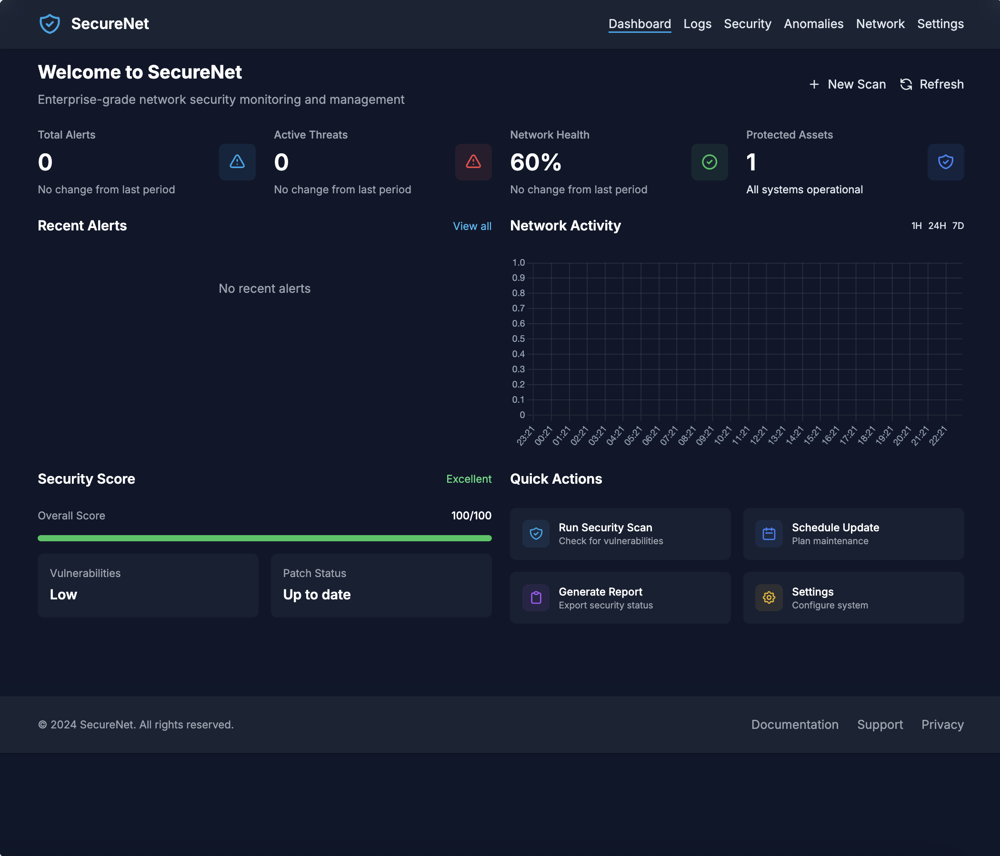
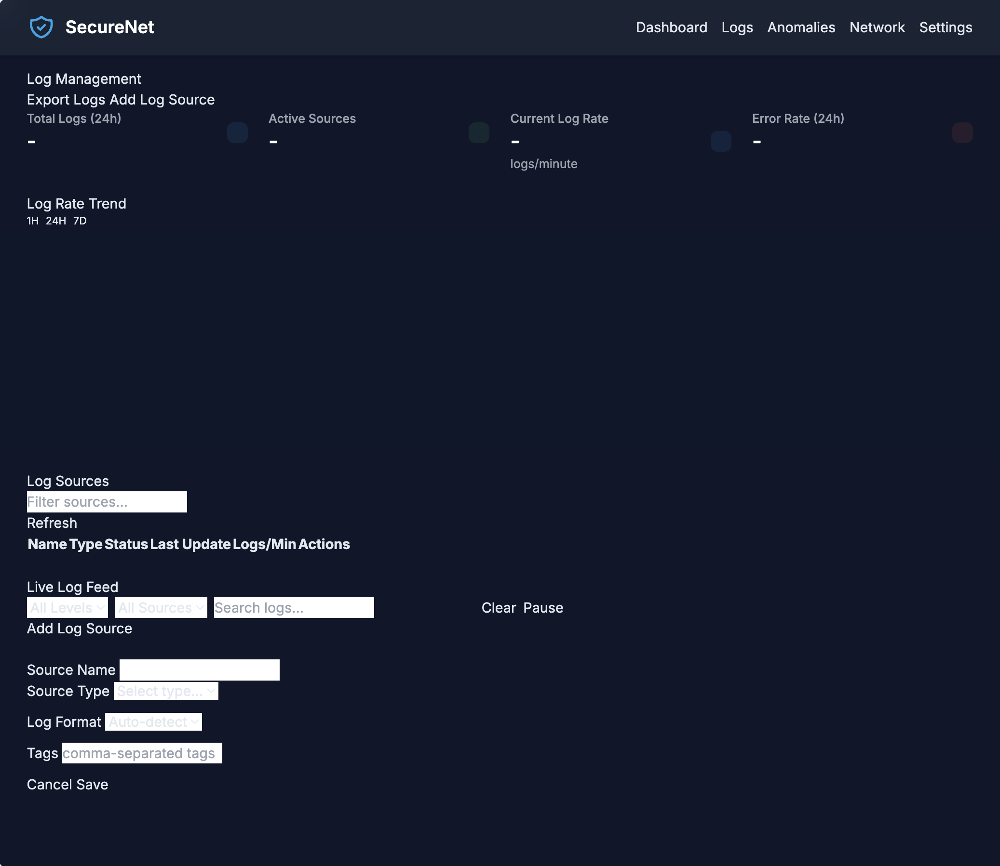
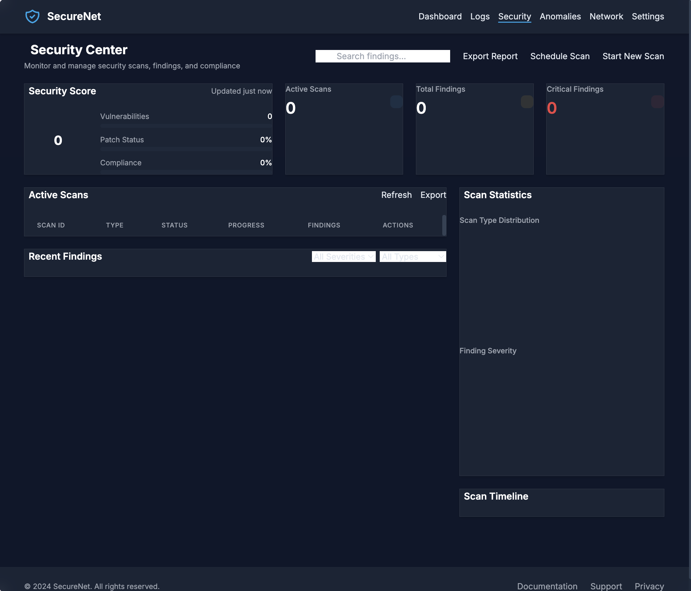
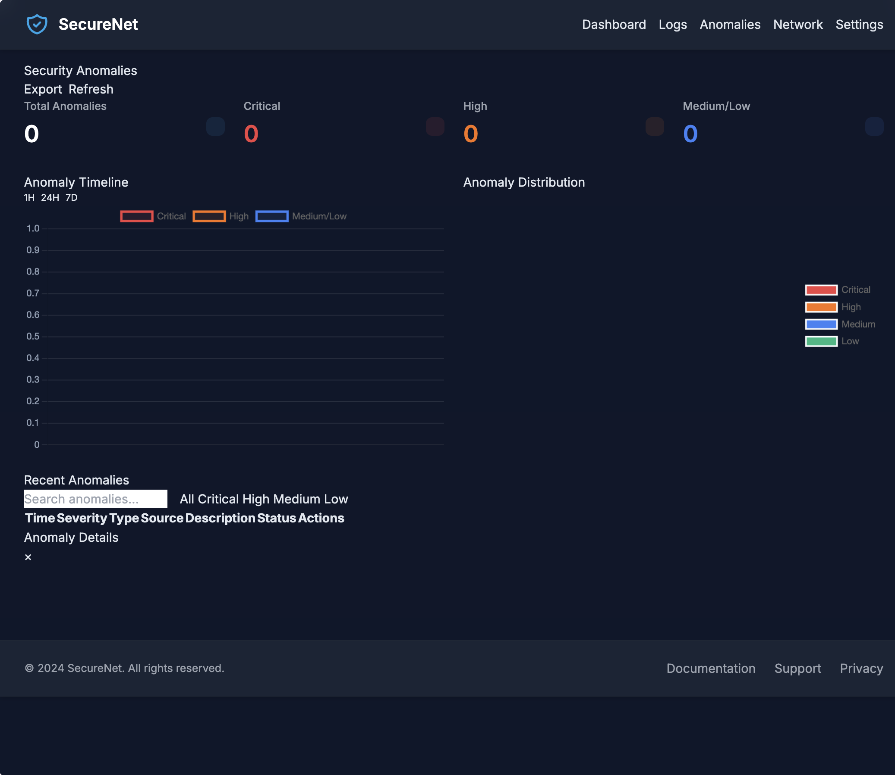
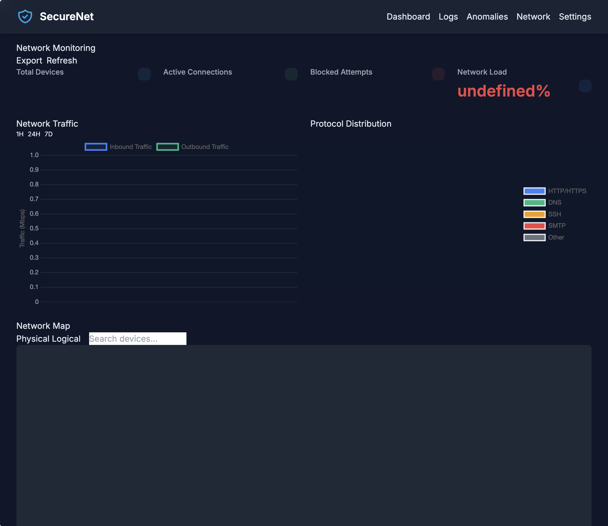
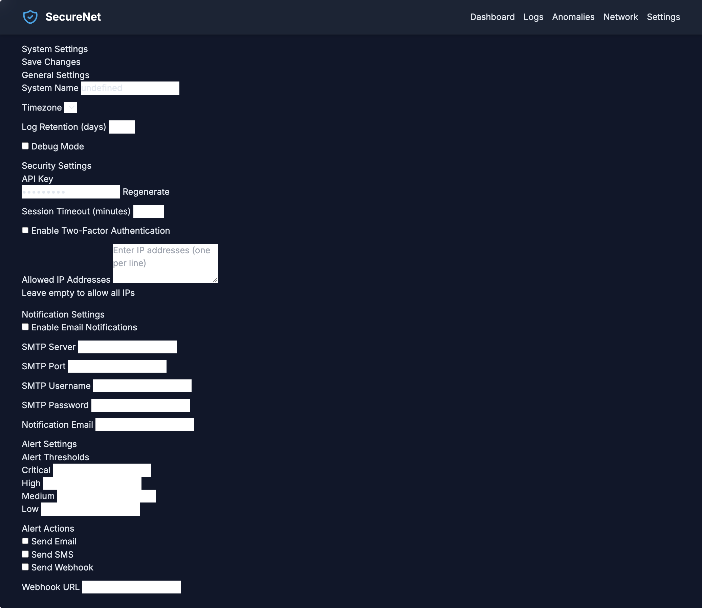

# 🔐 SecureNet

[](https://www.python.org/downloads/)
[](LICENSE.txt)
[](https://fastapi.tiangolo.com/)
[](tests/)
[](SECURITY.md)
[]()

> AI-powered network security monitoring and management system with real-time threat detection, network health monitoring, and comprehensive security management.

## 📌 Quick Links

- [Features](#-features)
- [Getting Started](#-getting-started)
- [Project Structure](#-project-structure)
- [Documentation](#-documentation)
- [Screenshots](#-screenshots)
- [API Reference](#-api-reference)
- [Testing](#-testing)
- [Roadmap](#️-roadmap)
- [Contributing](#-contributing)
- [Security](#-security--compliance)
- [License](#-license)

## ✨ Features

### Core Capabilities
- 🔍 **Real-time Security Monitoring**
  - ML-based threat detection using scikit-learn
  - Network health monitoring and scoring
  - Real-time security metrics via WebSocket
  - Asset protection status tracking
  - Vulnerability assessment
  - Patch status monitoring
  - Security incident tracking
  - Live threat feed with WebSocket updates
  - Severity-based threat categorization
  - Enhanced anomaly visualization with:
    - Interactive timeline charts
    - Severity distribution analysis
    - Real-time anomaly updates via WebSocket
    - Advanced filtering and search
    - Detailed anomaly inspection
    - Export capabilities
    - Trend analysis and statistics
  - **Advanced Security Scanning**
    - Real-time security scan management via WebSocket
    - Multiple scan types:
      - Full system scans
      - Vulnerability scans
      - Compliance checks
      - Custom scans
    - Scan scheduling with datetime support
    - Real-time scan progress monitoring
    - Detailed findings management
    - Severity-based finding categorization
    - Finding status tracking
    - Export capabilities for scan results
    - WebSocket-based real-time updates
    - Interactive scan dashboard with charts
    - Scan history and statistics

- 📊 **Interactive Dashboard**
  - Real-time security metrics and statistics
  - Network health visualization
  - Active threat monitoring
  - Asset protection status
  - Network traffic analysis
  - Security score tracking
  - Maintenance scheduling
  - Report generation
  - Live log streaming with WebSocket support
  - Dynamic log source management
  - Interactive web UI with FastAPI + Jinja2
  - Color-coded security indicators
  - Real-time data updates

- 🌐 **Network Management**
  - Network device discovery and monitoring
  - Connection tracking and management
  - Traffic analysis and visualization
  - Network health metrics
  - Automated threat response
  - Connection blocking capabilities
  - Network scan scheduling
  - Maintenance window management
  - Enhanced network visualization with:
    - Interactive network map (physical/logical views)
    - Real-time device status monitoring
    - Protocol distribution analysis
    - Traffic pattern visualization
    - Connection filtering and search
    - Device details inspection
    - Network data export
    - Performance trend tracking
  - macOS-compatible network monitoring:
    - Native `netstat` integration for connection tracking
    - Enhanced permission handling
    - Improved error reporting
    - Cross-platform compatibility
    - Real-time connection state updates
    - Detailed protocol information
    - Connection history tracking

- 📝 **Advanced Log Management**
  - Multiple log source types:
    - Syslog (UDP/TCP)
    - File monitoring with pattern matching
    - API endpoints with authentication
    - Database queries with polling
  - Flexible log format support:
    - Auto-detect
    - JSON
    - Syslog
    - CSV
    - Custom format patterns
  - Real-time log streaming with WebSocket
  - Interactive log feed with:
    - Color-coded log levels
    - Expandable log entries
    - Real-time filtering
    - Pause/Resume functionality
    - Clear feed option
    - Advanced search capabilities:
      - Full-text search
      - Regular expression support
      - Field-specific filtering
      - Time-based filtering
      - Log level filtering
      - Source-based filtering
    - Log analysis features:
      - Log aggregation
      - Pattern detection
      - Trend analysis
      - Statistical summaries
      - Custom visualization
    - Export options:
      - CSV format
      - JSON format
      - PDF reports
      - Custom templates
  - Log source management:
    - Add/Edit/Delete sources
    - Enable/Disable sources
    - Status monitoring
    - Log rate tracking
    - Tag-based organization
    - Source health metrics
    - Configuration validation
  - SQLite database with:
    - Efficient log storage
    - Optimized indexes
    - Log statistics
    - Source configuration
    - Enhanced query performance
    - Automatic maintenance

- 🔔 **Alerting System**
  - Real-time notification center
  - Unread notification counter
  - Notification history
  - Slack integration for instant notifications
  - Email alerts for critical events
  - Configurable alert thresholds
  - Custom alert templates
  - Interactive notification management

### Planned Features
- 🤖 GPT-based security analysis and recommendations
- ☁️ Cloud service integration (AWS, Azure, GCP)
- 🐳 Docker containerization
- 🔄 CI/CD pipeline
- 📈 Advanced analytics dashboard
- 🔐 Zero-trust security model implementation

### Recent Updates

#### Security Scanning Implementation
- Added comprehensive security scanning system
- Implemented real-time scan management interface
- Added support for multiple scan types (full, vulnerability, compliance, custom)
- Integrated scan scheduling with cron support
- Added real-time scan progress monitoring via WebSocket
- Implemented findings management with severity tracking
- Added export capabilities for scan results
- Enhanced security dashboard with scan statistics
- Improved error handling and reporting for scans
- Added interactive scan details view
- Implemented finding status management
- Added scan scheduling interface

#### Network Monitoring Improvements
- Enhanced macOS compatibility with native `netstat` integration
- Improved permission handling for network connection access
- Better error reporting and logging for network operations
- Cross-platform compatibility improvements
- Real-time connection state tracking
- Detailed protocol information display
- Connection history and trend analysis

#### Log Management Enhancements
- Advanced search capabilities with full-text and regex support
- Log aggregation and pattern detection
- Statistical analysis and trend visualization
- Multiple export formats (CSV, JSON, PDF)
- Enhanced source management with health metrics
- Improved database performance and maintenance
- Better error handling and reporting

#### UI/UX Improvements
- Modernized log viewer interface
- Advanced filtering and search options
- Interactive log analysis panels
- Real-time log statistics
- Export functionality
- Improved error messages and notifications
- Enhanced mobile responsiveness

## 🚀 Getting Started

### Prerequisites
- Python 3.8 or higher
- `pip` package manager
- Virtual environment (recommended)
- SQLite3 (included with Python)

### Installation

1. Clone the repository:
```bash
git clone https://github.com/your-username/SecureNet.git
cd SecureNet
```

2. Set up virtual environment:
```bash
python3 -m venv venv
source venv/bin/activate  # On Windows: venv\Scripts\activate
```

3. Install dependencies:
```bash
pip install -r requirements.txt
```

4. Initialize the database:
```bash
python scripts/init_db.py
```

5. Generate an API key:
```bash
python scripts/generate_api_key.py
```

6. Start the application:
```bash
uvicorn app:app --reload
```

The application will be available at `http://localhost:8000`

### Environment Variables
Create a `.env` file based on `.env.example`:
```env
SECRET_KEY=your-secret-key
API_KEY=your-api-key
DATABASE_URL=sqlite:///data/securenet.db
LOG_LEVEL=INFO
```

### Running the System

1. Start the dashboard:
```bash
uvicorn app:app --reload
```

2. Access the dashboard at http://localhost:8000

3. Configure log sources:
   - Navigate to the Log Ingestion page
   - Click "Add Log Source"
   - Select source type:
     - Syslog: Configure host, port, and protocol (UDP/TCP)
     - File: Set path, pattern, and recursive options
     - API: Configure endpoint and authentication
     - Database: Set connection and query details
   - Choose log format:
     - Auto-detect: Automatically identify format
     - JSON: Parse JSON-structured logs
     - Syslog: Standard syslog format
     - CSV: Comma-separated values
     - Custom: Define your own pattern
   - Add tags for organization
   - Save and enable the source

4. Monitor logs:
   - View real-time log feed
   - Filter logs by content
   - Pause/Resume feed
   - Clear feed when needed
   - Monitor source status
   - Track log rates
   - Manage multiple sources

5. Use the control panel to:
   - Start/Stop log ingestion service
   - Start/Stop anomaly detection service
   - Start/Stop alert service
   - Monitor service statistics
   - View and manage anomalies
   - Configure log sources
   - Monitor real-time logs
   - View threat feed
   - Manage notifications

## 📸 Screenshots

### Dashboard

*Comprehensive dashboard featuring:
- Real-time security metrics and statistics
- Network health visualization
- Active threat monitoring
- Asset protection status
- Security score tracking
- Service status indicators
- Quick action buttons
- Real-time data updates via WebSocket*

### Log Management

*Advanced log management interface featuring:
- Real-time log streaming with WebSocket support
- Color-coded log levels for easy identification
- Expandable log entries for detailed inspection
- Advanced filtering and search capabilities
- Log source management and monitoring
- Export functionality for analysis
- Log statistics and trend visualization
- Source health metrics and status tracking*

### Security Center

*Enhanced security management center featuring:
- Real-time security scan management
- Multiple scan type support (full, vulnerability, compliance, custom)
- Active scan monitoring with progress tracking
- Scan scheduling and automation
- Findings management with severity tracking
- Interactive scan dashboard
- Export capabilities for scan results
- Real-time WebSocket updates
- Scan history and statistics
- Finding status management
- Severity-based categorization
- Detailed scan inspection*

### Anomalies View

*Advanced anomaly detection dashboard featuring:
- Real-time anomaly statistics with trend indicators
- Interactive timeline visualization
- Severity-based distribution analysis
- Advanced filtering and search capabilities
- Detailed anomaly inspection modal
- Export functionality for analysis
- ML-based threat detection metrics
- Pattern recognition visualization
- Anomaly correlation analysis
- Real-time WebSocket updates*

### Network Monitoring 

*Comprehensive network monitoring center featuring:
- Real-time device and connection statistics
- Interactive network traffic visualization
- Protocol distribution analysis
- Dynamic network map with device discovery
- Connection filtering and management
- Device details inspection
- Network data export capabilities
- Traffic pattern analysis
- Connection history tracking
- Native macOS network monitoring
- Real-time connection state updates
- Performance trend tracking*

### Settings

*Configuration management interface featuring:
- Log source configuration and management
- Notification settings and preferences
- API key management
- Security scan configuration
- Network monitoring settings
- Alert threshold configuration
- System preferences
- User management
- Export/Import settings
- Backup and restore options*

## 📚 Documentation

### Architecture

SecureNet follows a modular architecture:
- **Data Sources:** 
  - Syslog server (UDP/TCP)
  - File system monitoring
  - API endpoints
  - Database queries
  - Network devices
  - Security scanners
- **Data Pipeline:** 
  - Log ingestion → Format detection → Processing → Storage
  - Network monitoring → Traffic analysis → Health scoring
  - Security scanning → Threat detection → Vulnerability assessment
  - Real-time WebSocket streaming
  - Notification broadcasting
- **Security Management:**
  - Network health monitoring
  - Threat detection and tracking
  - Vulnerability assessment
  - Patch management
  - Security scoring
  - Maintenance scheduling
- **Log Management:**
  - Source configuration and monitoring
  - Format detection and parsing
  - Real-time streaming
  - Efficient storage
  - Statistics tracking
- **AI Engine:** 
  - Isolation Forest (scikit-learn)
  - Real-time anomaly scoring
  - Network health analysis
  - Security risk assessment
- **Alerting:** 
  - Real-time notification center
  - Configurable notification system
- **Dashboard:** 
  - FastAPI + Jinja2 templates
  - WebSocket for real-time updates
  - Bootstrap for modern UI
  - Interactive visualizations
- **Database:** 
  - SQLite with optimized schema
  - Log source management
  - Network device tracking
  - Security metrics storage
  - Asset management
  - Statistics and monitoring
- **UI Components:**
  - Modern, responsive dashboard with real-time updates
  - Interactive visualizations using Chart.js
  - Dynamic network mapping with vis.js
  - Real-time WebSocket notifications
  - Advanced filtering and search capabilities
  - Modal-based detailed views
  - Export functionality for data analysis
  - Consistent design language across all screens

### API Reference

#### Dashboard Endpoints
- `GET /api/stats/overview` - Get dashboard statistics
- `GET /api/network/traffic` - Get network traffic data
- `GET /api/security/score` - Get security score and status
- `POST /api/scan/start` - Start network scan
- `POST /api/security/scan` - Start security scan
- `POST /api/maintenance/schedule` - Schedule maintenance
- `POST /api/reports/generate` - Generate security reports

#### Log Management
- `GET /api/logs` - Get logs with filtering
- `GET /api/logs/stats` - Get log statistics
- `GET /api/logs/sources` - Get log sources
- `POST /api/logs/sources` - Create log source
- `PUT /api/logs/sources/{source_id}` - Update log source
- `DELETE /api/logs/sources/{source_id}` - Delete log source
- `POST /api/logs/sources/{source_id}/toggle` - Toggle log source
- `GET /api/logs/search` - Advanced log search
- `GET /api/logs/aggregate` - Get log aggregation
- `GET /api/logs/export` - Export logs
- `GET /api/logs/patterns` - Get log patterns
- `GET /api/logs/trends` - Get log trends

#### Network Management
- `GET /api/network/overview` - Get network overview
- `GET /api/network/connections` - Get network connections
- `GET /api/network/connections/{connection_id}` - Get specific connection
- `POST /api/network/connections/{connection_id}/block` - Block connection
- `GET /api/network/stats` - Get network statistics
- `GET /api/network/protocols` - Get protocol distribution
- `GET /api/network/history` - Get connection history

#### Security Management
- `GET /api/anomalies` - Get all anomalies
- `GET /api/anomalies/{anomaly_id}` - Get specific anomaly
- `POST /api/anomalies/{anomaly_id}/resolve` - Resolve anomaly

#### Settings
- `GET /api/settings` - Get current settings
- `PUT /api/settings` - Update settings
- `POST /api/settings/api-key` - Regenerate API key

#### WebSocket Endpoints
- `WS /ws/logs` - Real-time log updates
- `WS /ws/notifications` - Real-time notifications

### Authentication

All API endpoints require authentication using an API key. Include the API key in the `X-API-Key` header:

```bash
curl -H "X-API-Key: your-api-key" http://localhost:8000/api/logs
```

### WebSocket Connections

Connect to WebSocket endpoints for real-time updates:

```javascript
// Log updates
const ws = new WebSocket('ws://localhost:8000/ws/logs');
ws.onmessage = (event) => {
    console.log('New log:', JSON.parse(event.data));
};

// Notifications
const ws = new WebSocket('ws://localhost:8000/ws/notifications');
ws.onmessage = (event) => {
    console.log('New notification:', JSON.parse(event.data));
};
```

## 🧪 Testing

### Running Tests

1. Activate virtual environment:
```bash
source venv/bin/activate
```

2. Run test suite:
```bash
# All tests
python -m pytest -v

# Specific test file
python -m pytest tests/test_dashboard.py -v
```

### Test Coverage

- `test_ingestion.py`: Log ingestion and storage
- `test_detect_anomalies.py`: ML model and scoring
- `test_dashboard.py`: UI rendering and data display
- WebSocket connection testing
- Real-time log streaming
- Notification system

## 🛣️ Roadmap

### ✅ Phase 1: Core Infrastructure (Completed)
- [x] Define real-time/batch detection scope
- [x] Identify threat types (anomaly detection, unauthorized access, malware behavior)
- [x] Design high-level architecture
- [x] Implement FastAPI + Jinja2 dashboard
- [x] Set up SQLite database with optimized schema
- [x] Implement WebSocket infrastructure for real-time updates
- [x] Create base UI components and templates

### ✅ Phase 2: Security & Monitoring (Completed)
- [x] Implement log ingestion system
  - [x] Multiple log source types (Syslog, File, API, Database)
  - [x] Real-time log streaming via WebSocket
  - [x] Advanced filtering and search
  - [x] Export capabilities
- [x] Deploy ML-based anomaly detection
  - [x] Isolation Forest model integration
  - [x] Real-time anomaly scoring
  - [x] Interactive visualization
- [x] Implement security scanning
  - [x] Multiple scan types (full, vulnerability, compliance)
  - [x] Real-time scan management
  - [x] Findings tracking and management
  - [x] Scan scheduling
- [x] Set up network monitoring
  - [x] macOS-compatible connection tracking
  - [x] Protocol analysis
  - [x] Device management
  - [x] Real-time traffic visualization

### ✅ Phase 3: API & Authentication (Completed)
- [x] Implement API key authentication
- [x] Create RESTful API endpoints
- [x] Set up WebSocket endpoints
- [x] Implement real-time notification system
- [x] Add API documentation

### 🔄 Phase 4: Enhanced Security (In Progress)
- [x] Basic API authentication
- [ ] Encrypt logs at rest and in transit
- [ ] Implement role-based access control
- [ ] Add comprehensive audit logging
- [ ] Enhance WebSocket security
- [ ] Add rate limiting
- [ ] Implement IP whitelisting

### 🔄 Phase 5: Cloud Integration (In Progress)
- [ ] AWS GuardDuty and Security Hub integration
- [ ] Log ingestion via S3
- [ ] Terraform-based infrastructure as code
- [ ] Docker containerization
- [ ] Kubernetes deployment
- [ ] Cloud-native monitoring

### 🔄 Phase 6: Testing & Deployment (In Progress)
- [x] Basic unit/integration tests
- [ ] Comprehensive test suite
- [ ] Simulated attack testing
- [ ] Performance testing
- [ ] CI/CD pipeline
- [ ] Automated deployment

### 🚀 Future Enhancements
- [ ] Threat intelligence feed integration
- [ ] Transformer-based NLP for log analysis
- [ ] GPT-style log summary generation
- [ ] Automated response playbooks
- [ ] Advanced analytics dashboard
- [ ] Machine learning model improvements
- [ ] Mobile application
- [ ] API client libraries

## 🤝 Contributing

We welcome contributions! Please see [CONTRIBUTING.md](CONTRIBUTING.md) for guidelines.

## 🔒 Security & Compliance

- Encrypted log handling
- JWT-based API authentication (planned)
- Role-based access control
- Audit logging
- Secure WebSocket connections
- Environment variable management

## 📝 License

Distributed under the MIT License. See [LICENSE.txt](LICENSE.txt) for details.

## 📬 Contact

**Pierre Mvita**  
📧 [petermvita@hotmail.com](mailto:petermvita@hotmail.com)  
🔗 [GitHub](https://github.com/pmvita)  
🔗 [LinkedIn](https://www.linkedin.com/in/pierre-mvita)

---

<div align="center">
Made by Pierre Mvita
</div>

## 📁 Project Structure

```
SecureNet/
├── app.py                 # Main FastAPI application
├── database.py           # Database models and operations
├── requirements.txt      # Python dependencies
├── README.md            # Project documentation
├── LICENSE.txt          # MIT License
├── CONTRIBUTING.md      # Contribution guidelines
├── TODO.md             # Project roadmap
├── .env.example        # Environment variables template
├── .gitignore         # Git ignore rules
├── templates/         # Jinja2 templates
│   ├── base.html     # Base template
│   ├── home.html     # Dashboard
│   ├── security.html # Security center
│   ├── logs.html     # Log management
│   ├── network.html  # Network monitoring
│   ├── anomalies.html # Anomaly detection
│   └── settings.html  # System settings
├── static/           # Static assets
├── data/            # Data storage
├── scripts/         # Utility scripts
├── tests/           # Test suite
├── models/          # ML models
├── config/          # Configuration files
└── src/            # Source code modules
```

## 🔌 API Reference

### Authentication
All API endpoints require authentication using an API key. Include the API key in the request header:
```
X-API-Key: your-api-key
```

### WebSocket Endpoints
- `/ws/notifications` - Real-time notifications
- `/ws/security` - Security scan updates
- `/ws/logs` - Live log streaming

### REST Endpoints
- `GET /api/stats/overview` - System overview statistics
- `GET /api/logs` - Log retrieval with filtering
- `GET /api/network/traffic` - Network traffic data
- `GET /api/security/score` - Security score
- `GET /api/network/overview` - Network overview
- `GET /api/network/protocols` - Protocol statistics
- `GET /api/network/devices` - Device information
- `GET /api/network/connections` - Active connections
- `GET /api/settings` - System settings
- `GET /api/anomalies` - Anomaly detection results

### Security Endpoints
- `GET /api/security/scans` - List security scans
- `POST /api/security/scan` - Start new scan
- `GET /api/security/scan/{id}` - Get scan details
- `POST /api/security/scan/{id}/stop` - Stop running scan
- `GET /api/security/scan/{id}/findings` - Get scan findings
- `PUT /api/security/scan/{id}/findings/{finding_id}` - Update finding status
