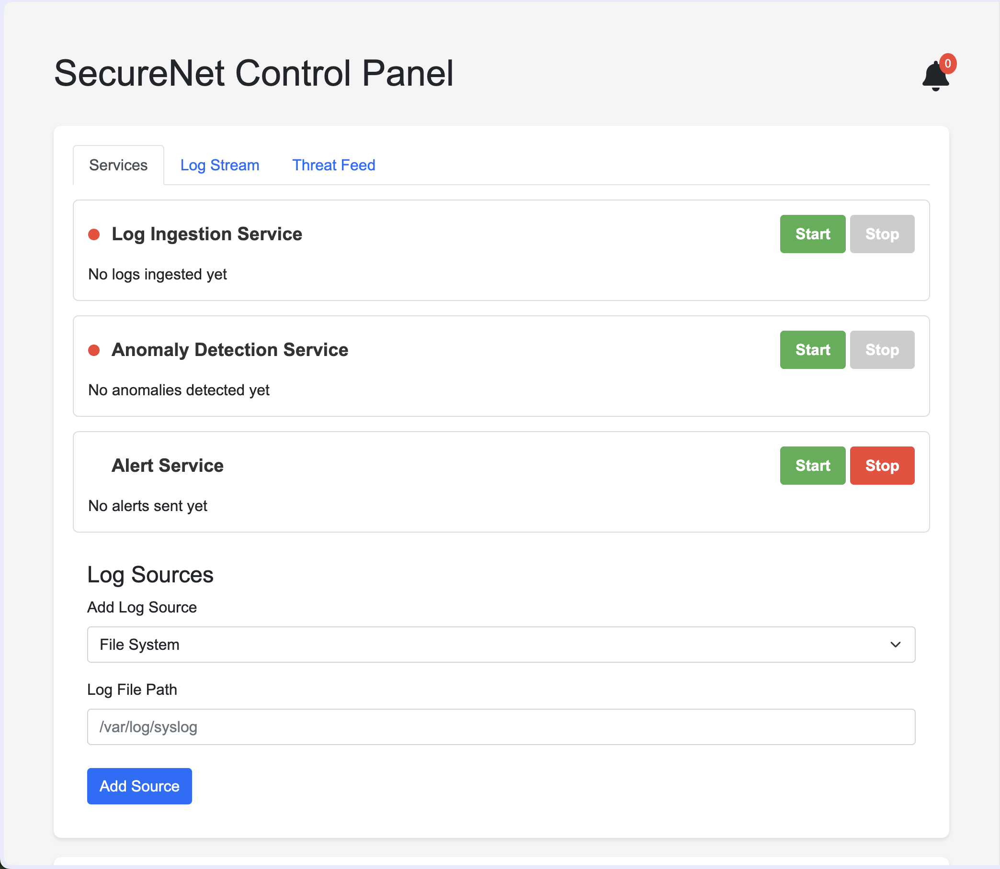
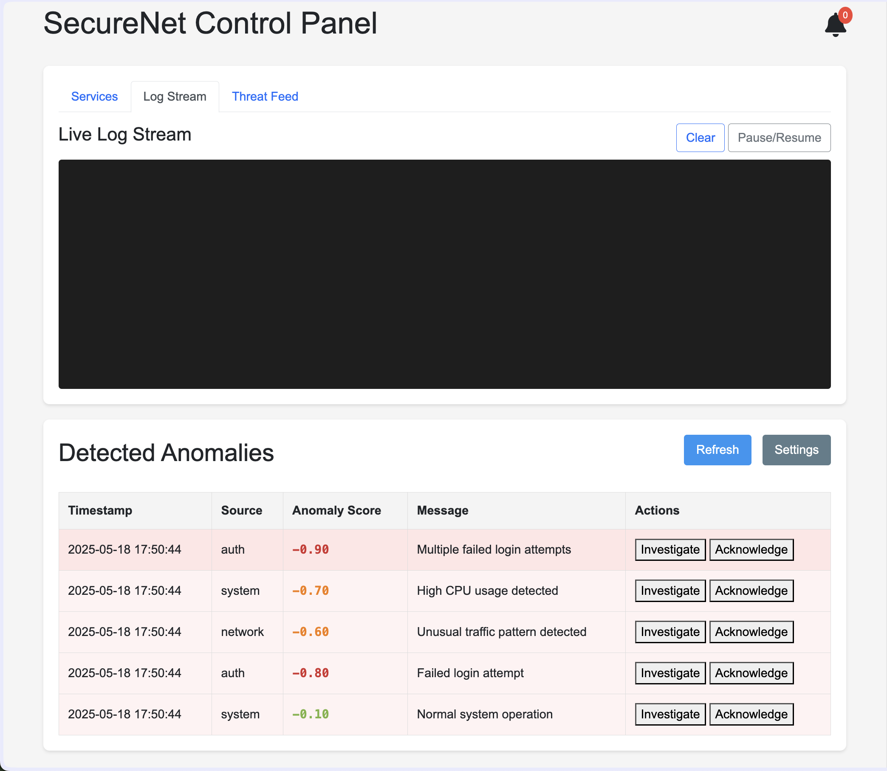

# 🔐 SecureNet

[](https://www.python.org/downloads/)
[](LICENSE.txt)
[](https://fastapi.tiangolo.com/)
[](tests/)
[](SECURITY.md)
[]()

> AI-powered threat detection system for identifying anomalies in system and cloud logs using machine learning.

## 📌 Quick Links

- [Features](#-features)
- [Getting Started](#-getting-started)
- [Documentation](#-documentation)
- [Screenshots](#-screenshots)
- [Testing](#-testing)
- [Roadmap](#️-roadmap)
- [Contributing](#-contributing)
- [Security](#-security--compliance)
- [License](#-license)

## ✨ Features

### Core Capabilities
- 🔍 **Real-time Anomaly Detection**
  - ML-based detection using scikit-learn
  - Isolation Forest algorithm for zero-day threat detection
  - Configurable detection thresholds
  - Live threat feed with real-time updates
  - Severity-based threat categorization

- 📊 **Interactive Dashboard**
  - Real-time service control panel
  - Live log streaming with WebSocket support
  - Dynamic log source management
  - Start/Stop controls for all services
  - Live service statistics
  - Real-time anomaly data display
  - Severity-based highlighting (high/medium/low)
  - Interactive web UI with FastAPI + Jinja2
  - Color-coded anomaly scores
  - Anomaly investigation and acknowledgment

- 📝 **Log Management**
  - Multiple log source support:
    - File system logs
    - Syslog server
    - AWS CloudTrail
    - Custom endpoints
  - Real-time log streaming
  - Log level filtering (info/warning/error)
  - SQLite database for log storage
  - Efficient log parsing and processing
  - Service operation tracking
  - Configurable service settings

- 🔔 **Alerting System**
  - Real-time notification center
  - Unread notification counter
  - Notification history
  - Slack integration for instant notifications
  - Email alerts for critical events
  - Configurable alert thresholds
  - Custom alert templates
  - Interactive notification management

### Planned Features
- 🤖 GPT-based anomaly explanation summaries
- ☁️ AWS CloudTrail integration
- 🐳 Docker containerization
- 🔄 CI/CD pipeline
- 📈 Advanced analytics dashboard

## 🚀 Getting Started

### Prerequisites
- Python 3.8 or higher
- `pip` package manager
- Virtual environment (recommended)

### Installation

1. Clone the repository:
```bash
git clone https://github.com/your-username/SecureNet.git
cd SecureNet
```

2. Set up virtual environment:
```bash
python3 -m venv venv
source venv/bin/activate  # On Windows: venv\Scripts\activate
```

3. Install dependencies:
```bash
pip install -r requirements.txt
```

4. Configure environment:
```bash
cp .env.example .env
# Edit .env with your settings
```

5. Initialize the database:
```bash
python scripts/init_db.py
```

### Running the System

1. Start the dashboard:
```bash
uvicorn src.app:app --reload
```

2. Access the dashboard at http://localhost:8000

3. Configure log sources:
   - Click "Add Log Source" in the Services tab
   - Select source type (File, Syslog, AWS, or Custom)
   - Configure source settings
   - Click "Add Source" to start monitoring

4. Use the control panel to:
   - Start/Stop log ingestion service
   - Start/Stop anomaly detection service
   - Start/Stop alert service
   - Monitor service statistics
   - View and manage anomalies
   - Configure log sources
   - Monitor real-time logs
   - View threat feed
   - Manage notifications

## 📸 Screenshots

### Control Panel

*Service control panel with real-time status indicators and statistics*

### Log Stream

*Real-time log streaming with color-coded log levels*

### Anomalies View

*Anomaly dashboard with severity highlighting and action buttons*

### Notification Center

*Real-time notification center with unread counter*

## 📚 Documentation

### Architecture

SecureNet follows a modular architecture:
- **Data Sources:** 
  - File system logs
  - Syslog server
  - AWS CloudTrail
  - Custom endpoints
- **Data Pipeline:** 
  - Log ingestion → Feature extraction → ML detection
  - Real-time WebSocket streaming
  - Notification broadcasting
- **AI Engine:** 
  - Isolation Forest (scikit-learn)
  - Real-time anomaly scoring
- **Alerting:** 
  - Real-time notification center
  - Configurable notification system
- **Dashboard:** 
  - FastAPI + Jinja2 templates
  - WebSocket for real-time updates
  - Bootstrap for modern UI
- **Database:** 
  - SQLite with service tracking
  - Log source configuration
  - Notification history

### Directory Structure
```
SecureNet/
├── config/                    # Configuration files
│   └── settings.yaml         # Application settings
├── data/                     # Data storage
│   ├── logs.db              # SQLite database for logs
│   ├── init_schema.sql      # Initial database schema
│   └── sample_logs.json     # Sample log data
├── models/                   # ML models
│   └── isolation_forest.pkl # Trained anomaly detection model
├── screenshots/             # Documentation screenshots
│   ├── control_panel.png    # Dashboard control panel
│   ├── log_stream.png      # Real-time log stream
│   ├── anomalies_view.png   # Anomalies display
│   └── notification_center.png # Notification system
├── scripts/                 # Utility scripts
│   ├── init_db.py          # Database initialization
│   └── update_db.py        # Database schema updates
├── src/                     # Core application code
│   ├── __init__.py         # Package initialization
│   ├── alert.py            # Alerting system (Slack/Email)
│   ├── app.py              # FastAPI dashboard application
│   ├── detect_anomalies.py # ML anomaly detection
│   └── ingest_logs.py      # Log ingestion system
├── templates/               # Web templates
│   └── dashboard.html      # Dashboard template
├── tests/                   # Test suite
│   ├── README.md           # Testing documentation
│   ├── smoke_slack.py      # Slack integration test
│   ├── test_dashboard.py   # Dashboard tests
│   ├── test_detect_anomalies.py  # ML model tests
│   └── test_ingestion.py   # Log ingestion tests
├── venv/                    # Python virtual environment
├── .env                     # Environment variables (gitignored)
├── .env.example            # Example environment variables
├── CONTRIBUTING.md         # Contribution guidelines
├── LICENSE.txt             # MIT License
├── README.md               # Project documentation
├── TODO.md                 # Development tasks
├── requirements.txt        # Python dependencies
└── slack.txt              # Slack integration logs
```

## 🧪 Testing

### Running Tests

1. Activate virtual environment:
```bash
source venv/bin/activate
```

2. Run test suite:
```bash
# All tests
python -m pytest -v

# Specific test file
python -m pytest tests/test_dashboard.py -v
```

### Test Coverage

- `test_ingestion.py`: Log ingestion and storage
- `test_detect_anomalies.py`: ML model and scoring
- `test_dashboard.py`: UI rendering and data display
- WebSocket connection testing
- Real-time log streaming
- Notification system

## 🛣️ Roadmap

### ✅ Phase 1: Requirements & Architecture Planning
- [x] Define real-time or batch detection scope
- [x] Identify threat types: anomaly detection, unauthorized access, malware behavior
- [x] Design high-level architecture: 
  - Logs, telemetry, AWS CloudTrail → pipeline → ML engine → alerts + dashboard

### ✅ Phase 2: Core Components & Tools
- [x] Log ingestion from file system (system logs or CloudTrail)
- [x] SQLite-based log storage
- [x] ML model (Isolation Forest) for anomaly detection
- [x] Alerting system via CLI, Slack, or email
- [x] FastAPI + Jinja2 dashboard for basic UI

### 🔄 Phase 3: Cloud Integration
- [ ] AWS GuardDuty and Security Hub integration
- [ ] Log ingestion via S3, processing via Lambda or SageMaker
- [ ] Terraform-based IaC
- [ ] Docker + Kubernetes containerization

### 🔒 Phase 4: Security & Compliance
- [ ] Encrypt logs at rest and in transit
- [ ] API authentication using OAuth2 or JWT
- [ ] Role-based access control
- [ ] Logging and audit trails

### 📊 Phase 5: Testing & Deployment
- [ ] Unit/integration tests
- [ ] Simulated attacks with Atomic Red Team or Caldera
- [ ] GitHub Actions or CI/CD pipeline

### 🚀 Future Enhancements
- [ ] Threat intelligence feed integration (AlienVault, MISP)
- [ ] Transformer-based NLP anomaly detection
- [ ] GPT-style log summary module
- [ ] Automated response playbooks (SOAR behavior)

## 🤝 Contributing

We welcome contributions! Please see [CONTRIBUTING.md](CONTRIBUTING.md) for guidelines.

## 🔒 Security & Compliance

- Encrypted log handling
- JWT-based API authentication (planned)
- Role-based access control
- Audit logging
- Secure WebSocket connections
- Environment variable management

## 📝 License

Distributed under the MIT License. See [LICENSE.txt](LICENSE.txt) for details.

## 📬 Contact

**Pierre Mvita**  
📧 [petermvita@hotmail.com](mailto:petermvita@hotmail.com)  
🔗 [GitHub](https://github.com/pmvita)  
🔗 [LinkedIn](https://www.linkedin.com/in/pierre-mvita)

---

<div align="center">
Made by Pierre Mvita
</div>
