# 🏢 SecureNet v2.2.0-enterprise

> **AI-Powered Network Defense. Enterprise-Grade Intelligence. Global-Scale Operations.**

[](./docs/certification/ENTERPRISE_CERTIFICATION.md)
[](./docs/compliance/soc2-readiness.md)
[](./docs/compliance/security-hardening.md)
[](./docs/compliance/COMPLIANCE_FRAMEWORKS.md)
[](./LICENSE.txt)

**SecureNet** is an AI-powered cybersecurity platform delivers autonomous threat detection, predictive risk assessment, and intelligent security operations management. It empowers organizations to efficiently manage network security, detect threats, and protect against cyber attacks, ensuring a secure and resilient network environment.

---

## ⭐ **Quick Actions**

<div align="center">

[⭐ **Star this repo**](https://github.com/yourusername/securenet) • [📖 **View Documentation**](./docs/installation/INSTALLATION.md) • [🚀 **System Status**](./docs/system/SYSTEM-STATUS.md) • [🎯 **Launch Roadmap**](./docs/project/PRODUCTION_LAUNCH_ROADMAP.md)

</div>

---

## 🚀 **Key Features**

<table>
<tr>
<td width="50%">

### 🧠 **AI-Powered Threat Detection**
- Machine learning anomaly detection
- Behavioral pattern recognition
- Predictive risk assessment
- Automated threat classification

### 🔍 **Live Network Discovery**
- Real-time device scanning (192.168.x.0/24)
- Smart device classification (Router, IoT, Mobile)
- Cross-platform support (macOS, Linux, Windows)
- Network topology visualization

### 🔔 **Real-Time Alert System**
- WebSocket-powered notifications
- Smart categorization & priority filtering
- Bulk operations & search functionality
- Mobile-responsive notification center

</td>
<td width="50%">

### 🔐 **Enterprise Security & RBAC**
- 3-tier role-based access control
- JWT + API key authentication
- Session tracking & audit logging
- Multi-tenant SaaS architecture

### 📊 **CVE Intelligence Integration**
- NIST NVD API connectivity
- Real-time vulnerability scoring (CVSS v3)
- CISA KEV tracking
- Vendor-specific analysis (Cisco, Fortinet, etc.)

### 📦 **SaaS Infrastructure**
- Stripe billing integration
- Organization management
- Usage analytics & metrics
- Docker deployment ready

</td>
</tr>
</table>

---

## 📸 **Platform Screenshots**

*Enterprise-Grade Security Operations Center Interface*

| Dashboard Overview | Log Management | Security Management |
|:------------------:|:-----------------:|:---------------:|
|  |  |  |

| Network Monitoring | Anomaly Detection | System Configuration |
|:---------------:|:----------------:|:-------------------:|
|  |  |  |

> **Note**: Screenshots demonstrate production-ready interface with enterprise security features. For complete visual documentation, see [Screenshots Guide](./docs/SCREENSHOTS.md).

---

## 🔐 **Enterprise Role-Based Access Control (RBAC)**

**SecureNet Enterprise implements a robust 3-tier RBAC system with enterprise-grade user management:**

| Role | Position | Responsibilities | Access Level |
|------|----------|------------------|--------------|
| 🏢 **Platform Owner** | Chief Information Security Officer (CISO) | Strategic oversight, compliance management, global tenant administration | Full enterprise access, audit trails, financial reporting |
| 🛡️ **Security Admin** | Security Operations Manager | SOC management, user provisioning, security policy enforcement | Organization administration, user management, security controls |
| 🔍 **SOC Analyst** | Tier 1/2/3 Security Analyst | Threat monitoring, incident response, security event analysis | Dashboard access, alert management, reporting tools |

### 🔒 **Enterprise Security Features**
- **Multi-Factor Authentication (MFA)** - Required for all enterprise accounts
- **Role-Based Permissions** - Granular access control with principle of least privilege
- **Session Management** - Advanced session tracking and timeout controls
- **Audit Logging** - Comprehensive audit trails for all user activities
- **Enterprise Email Integration** - Corporate email domain validation
- **Password Policies** - Enterprise-grade password complexity requirements

> 🏢 **Enterprise Deployment**: Contact SecureNet Enterprise Support for LDAP/AD integration, SSO configuration, and custom role mappings.

### **🏆 Founder Access Credentials**

**Pierre Mvita** - Founder, CEO & Chief Technology Officer

**Founder Privileges:**
- ✅ **Complete Financial Control** - All billing, revenue, subscription management
- ✅ **Strategic Business Intelligence** - Company-wide analytics, performance metrics
- ✅ **God-Mode System Access** - Complete database access, system configuration
- ✅ **Multi-Tenant Management** - Create, modify, delete any organization
- ✅ **Emergency Override** - Bypass all authentication for system recovery
- ✅ **Compliance Authority** - Override compliance settings for business requirements

> 📋 **Documentation**: [Founder Access Guide](./docs/reference/FOUNDER_ACCESS_DOCUMENTATION.md) - Complete founder access documentation

> 📋 **Documentation**: [Founder Implementation Summary](./docs/reference/FOUNDER_IMPLEMENTATION_SUMMARY.md) - Complete founder implementation documentation

---

## ⚡ **Quick Start**

### **Prerequisites**
- Python 3.8+ with pip
- Node.js 16+ with npm
- PostgreSQL 13+ (for enterprise features) or SQLite (development)
- Redis (for enhanced features)
- Git

### **1. Clone & Setup Backend**
```bash
git clone https://github.com/pmvita/securenet.git
cd SecureNet

# Create virtual environment
python -m venv venv
source venv/bin/activate  # Windows: venv\Scripts\activate

# Install dependencies
# For development (SQLite):
pip install -r requirements.txt

# For enterprise (PostgreSQL + full features):
pip install -r requirements-enterprise.txt
```

### **2. Database Setup**

#### **🏢 Enterprise (PostgreSQL)**
```bash
# Install PostgreSQL (macOS)
brew install postgresql
brew services start postgresql

# Install and setup PostgreSQL
brew install postgresql                    # macOS
sudo apt-get install postgresql          # Ubuntu/Debian
brew services start postgresql           # macOS
sudo systemctl start postgresql          # Linux

# Create database and user
createdb securenet
createuser -s securenet
psql -c "ALTER USER securenet PASSWORD 'securenet';"

# Run migration to PostgreSQL
python scripts/migrate_to_postgresql.py
```

#### **🛠 Development (SQLite)**
```bash
# SQLite database will be created automatically at data/securenet.db
# No additional setup required
```

### **3. Enterprise Production Startup**

#### **🏢 Enterprise Production Mode (Official)**
```bash
# Official SecureNet Enterprise startup entrypoint
python start_enterprise.py                    # Full enterprise production startup
python start_enterprise.py --check           # Validation only
python start_enterprise.py --validate-roles  # Role validation
python start_enterprise.py --health-check    # System health check

# Complete production environment (legacy compatibility)
./start_production.sh                        # Full production setup with security checks
```

#### **🚀 Production startup**
SecureNet provides comprehensive production startup capabilities with enterprise-grade validation, health monitoring, and CI/CD integration for seamless deployment automation.

#### **🔍 Enterprise Validation & CI/CD**
```bash
# Comprehensive enterprise production boot test
python scripts/ops/test_production_boot.py   # Full test suite
python scripts/ops/test_production_boot.py --quick          # Skip server startup
python scripts/ops/test_production_boot.py --enterprise-only # Enterprise tests only

# Expected output: ✅ ALL ENTERPRISE VALIDATION CHECKS PASSED
```

#### **🔧 CI/CD validation**
SecureNet includes comprehensive CI/CD validation pipelines with automated testing, deployment verification, and production readiness assessments for enterprise-grade continuous integration and deployment workflows.

#### **🩺 Health Check Endpoints**
```bash
# API health monitoring
curl http://localhost:8000/api/health         # System health status
curl http://localhost:8000/api/system/status  # Detailed system information

# Exit codes for CI/CD integration:
# 0 = All validations passed (production ready)  
# 1 = Validation failures detected (deployment blocked)
```

SecureNet provides comprehensive Health check endpoints for monitoring system status, component health, and production readiness validation with detailed metrics and status reporting for enterprise monitoring systems.

#### **🏢 Enterprise deployment**
SecureNet supports enterprise deployment scenarios including on-premise installations, cloud deployments, hybrid architectures, and multi-tenant SaaS configurations with comprehensive security, compliance, and scalability features.

- **📚 Complete Setup**: See [Startup Guide](./docs/setup/STARTUP_GUIDE.md) for comprehensive deployment instructions
- **🏢 Enterprise Deployment**: See [Production Configuration](./docs/setup/production_config.txt) for enterprise environment setup
- **🔧 Enhanced Features**: See [Enhanced Version Guide](./docs/setup/ENHANCED_VERSION_GUIDE.md) for advanced monitoring & ML capabilities

### **4. Setup Frontend**
```bash
# New terminal window
cd frontend
npm install

# Build for production
npm run build

# Start production preview
npm run preview

# Alternative: Development mode with mock data
npm run dev
```

### **5. Access SecureNet**
- **🎯 Dashboard**: http://localhost:5173
- **🔧 API**: http://localhost:8000
- **📚 API Docs**: http://localhost:8000/docs
- **📊 Enhanced Metrics**: http://localhost:8000/system/health (enhanced version only)

---

## 🛠️ **Technology Stack**

<div align="center">


</div>

**Backend**: FastAPI • PostgreSQL/SQLite • WebSockets • JWT Auth • Pydantic • Asyncio  
**Frontend**: React 18 • TypeScript • Vite • Tailwind CSS • Heroicons • Axios  
**AI/ML**: Custom algorithms • Scikit-learn • MLflow • Pattern recognition • Behavioral analytics  
**Enhanced**: Redis • RQ • Sentry • Prometheus • Structured logging • Cryptography  
**Infrastructure**: Docker • Kubernetes • Multi-tenant SaaS • Stripe billing • Real-time processing

---

## ✅ **Enterprise Readiness Checklist**

- ✅ **Role-Based Access Control** — 3-tier security model (Platform Owner → Security Admin → SOC Analyst)
- ✅ **CVE Integration** — Real-time NIST NVD API with CISA KEV tracking
- ✅ **SaaS Billing** — Stripe integration with subscription management
- ✅ **Audit Logging** — Comprehensive activity tracking and compliance
- ✅ **Predictive Analytics** — AI-driven threat detection and risk assessment
- ✅ **Multi-Tenant Architecture** — Organization isolation and management
- ✅ **Real-Time Monitoring** — WebSocket alerts and live data streaming
- ✅ **API-First Design** — RESTful endpoints with comprehensive documentation
- ✅ **Docker Support** — Containerized deployment and scaling
- ✅ **Security Hardening** — JWT authentication, API keys, session management

---

## 🧩 **SecureNet Enhanced Architecture**

SecureNet now offers **two deployment options** to meet different operational needs:

### **🏭 Original SecureNet (`app.py`)**
- ✅ **Production-ready** and battle-tested
- ✅ **Full feature set** with real-time monitoring
- ✅ **Stable architecture** for enterprise deployment
- ✅ **Compatible** with existing frontend and workflows

### **🚀 Enhanced SecureNet (`app_enhanced.py`)**
- ✅ **All original features** PLUS advanced capabilities
- 📊 **Prometheus metrics** and structured logging
- 🔍 **Sentry error monitoring** and distributed tracing
- 🤖 **MLflow experiment tracking** and model management
- ⚡ **Redis task queues** for background processing
- 🔐 **Advanced cryptography** and security services

> **Seamless Migration**: Both versions use the same database and frontend - switch anytime!

---

## 📁 **Technical Integration Guides**

### **🏗️ Backend Integration**
- [🚀 Startup Guide](./docs/setup/STARTUP_GUIDE.md) - Complete setup instructions for both versions
- [🔧 Production Configuration](./docs/setup/production_config.txt) - Environment setup template
- [🔒 Production Setup](./docs/setup/DEV_MODE_DISABLED.md) - Production mode configuration and security
- [⚡ Production Quick Reference](./docs/setup/PRODUCTION_QUICK_REFERENCE.md) - Fast production deployment commands
- [Phase 1: Observability](./docs/integration/phase-1-observability.md) - Monitoring and logging
- [Phase 2: Developer Experience](./docs/integration/phase-2-developer-experience.md) - Testing and ML tools
- [Phase 3: Advanced Tooling](./docs/integration/phase-3-advanced-tooling.md) - Cryptography and task queues

### **🎨 Frontend Integration**
- [🎨 Frontend Integration Hub](./docs/integration/frontend/README.md) - frontend enhancement roadmap
- ✅ [🚀 Phase 1: Immediate Enhancements](./docs/integration/frontend/phase-1-frontend-enhancements.md) - **COMPLETE** - Performance & reliability improvements
- ✅ [📊 Phase 2: UI & Visualization](./docs/integration/frontend/phase-2-ui-visualization.md) - **COMPLETE** - Advanced analytics & user experience
- ✅ [🏢 Phase 3: Enterprise Components](./docs/integration/frontend/phase-3-enterprise-components.md) - **COMPLETE** - Enterprise-grade development tools

---

## 📚 **Documentation Hub**

> **📖 Complete Documentation**: [docs/README.md](./docs/README.md) - Comprehensive documentation index

### **🏁 Quick Start Documentation**
| Documentation | Description | Status |
|---------------|-------------|--------|
| **[📖 Installation Guide](./docs/installation/INSTALLATION.md)** | Complete setup instructions for backend + frontend | ✅ Ready |
| **[🚀 Startup Guide](./docs/setup/STARTUP_GUIDE.md)** | Complete instructions for both original and enhanced versions | ✅ Ready |
| **[🗄️ PostgreSQL Setup](./docs/setup/POSTGRESQL_SETUP.md)** | Comprehensive PostgreSQL installation and configuration guide | ✅ Ready |
| **[🔧 Production Config](./docs/setup/production_config.txt)** | Environment configuration template and setup guide | ✅ Ready |

### **🏆 Enterprise & Certification**
| Documentation | Description | Status |
|---------------|-------------|--------|
| **[🏆 Enterprise Certification](./docs/certification/ENTERPRISE_CERTIFICATION.md)** | Official certification document (SN-ENT-2024-001) | ✅ Certified |
| **[📋 Final Audit Report](./docs/audit/FINAL_AUDIT_REPORT.md)** | Complete audit results (100% score) | ✅ Ready |
| **[🚀 Release Notes v2.2.0-enterprise](./docs/release/RELEASE_NOTES_v2.2.0-enterprise.md)** | Latest release details and features | ✅ Ready |
| **[📊 GitHub Release Summary](./docs/release/GITHUB_RELEASE_SUMMARY.md)** | GitHub release content | ✅ Ready |

### **🔐 Security & Compliance**
| Documentation | Description | Status |
|---------------|-------------|--------|
| **[🛡️ Security Features](./docs/features/FEATURES.md)** | ML threat detection, predictive analytics, behavioral analysis | ✅ Ready |
| **[🔒 Compliance Frameworks](./docs/compliance/COMPLIANCE_FRAMEWORKS.md)** | SOC 2, ISO 27001, GDPR, NIST, FedRAMP compliance details | ✅ Ready |
| **[🔥 CVE Integration](./docs/features/CVE-INTEGRATION-SUMMARY.md)** | NIST NVD API sync, vulnerability scoring, CISA KEV | ✅ Ready |

### **🏗️ Architecture & Development**
| Documentation | Description | Status |
|---------------|-------------|--------|
| **[🏗️ Frontend Architecture](./docs/architecture/FRONTEND-ARCHITECTURE.md)** | Component structure, design system, technical details | ✅ Ready |
| **[📡 API Reference](./docs/api/API-Reference.md)** | REST endpoints, WebSocket connections, authentication | ✅ Ready |
| **[🤝 Contributing Guide](./docs/contributing/CONTRIBUTING.md)** | Contribution guidelines and development workflow | ✅ Ready |
| **[📋 Changelog](./docs/project/CHANGELOG.md)** | Version history and release notes | ✅ Ready |

### **🔧 Operations & Monitoring**
| Documentation | Description | Status |
|---------------|-------------|--------|
| **[📊 System Status](./docs/system/SYSTEM-STATUS.md)** | Operational metrics, performance data, uptime monitoring | ✅ Ready |
| **[⚡ Enhanced Features](./docs/reference/ENHANCED_FEATURES.md)** | Feature comparison and enhanced capabilities reference | ✅ Ready |
| **[🗄️ Database Migration](./docs/migration/POSTGRESQL_MIGRATION_SUMMARY.md)** | Database migration and setup guide | ✅ Ready |

### **🏢 Enterprise Documentation**
| Documentation | Description | Status |
|---------------|-------------|--------|
| **[👥 Enterprise User Management](./docs/reference/ENTERPRISE_USER_MANAGEMENT.md)** | Complete user groups, account expiration, and access control guide | ✅ Ready |
| **[🏢 Enterprise Audit Report](./docs/enterprise/ENTERPRISE-AUDIT-REPORT.md)** | Enterprise audit details and assessment | ✅ Ready |
| **[📋 Enterprise Readiness Summary](./docs/enterprise/ENTERPRISE-READINESS-SUMMARY.md)** | Readiness assessment for enterprise deployment | ✅ Ready |
| **[🚀 Development Roadmap](./docs/project/DEVELOPMENT_ROADMAP.md)** | Complete 3-phase development cycle and future plans | ✅ Ready |
| **[👥 Project Governance](./docs/project/PROJECT_GOVERNANCE.md)** | Ownership, licensing, IP portfolio, and corporate structure | ✅ Ready |

### **🎯 Production Launch Preparation (Phase 3.5)**

| Documentation | Description | Status |
|---------------|-------------|--------|
| **[🚀 Production Launch Roadmap](./docs/project/PRODUCTION_LAUNCH_ROADMAP.md)** | 8-10 week sprint plan for production launch preparation | 🚧 **ACTIVE** |
| **[📅 Sprint Planning Guide](./docs/project/SPRINT_PLANNING.md)** | Immediate actionable sprint tasks and daily breakdowns | 🚧 **ACTIVE** |
| **[📋 Production Launch Checklist](./docs/setup/PRODUCTION_LAUNCH_CHECKLIST.md)** | Go/No-Go launch validation criteria and executive scorecard | 🚧 **ACTIVE** |

### **🧪 Audit & Validation Reports**
| Documentation | Description | Status |
|---------------|-------------|--------|
| **[🔍 Final Hardening Audit](./docs/audit/FINAL_HARDENING_AUDIT_REPORT.md)** | Security hardening validation results | ✅ Ready |
| **[⚡ Runtime Validation Report](./docs/audit/RUNTIME_VALIDATION_REPORT.md)** | Runtime performance and validation | ✅ Ready |
| **[🛡️ System Integrity Report](./docs/audit/SYSTEM_INTEGRITY_REPORT.md)** | System integrity and security validation | ✅ Ready |
| **[📋 Post-Resolution Audit](./docs/audit/POST_RESOLUTION_AUDIT_REPORT.md)** | Post-resolution audit and verification | ✅ Ready |

### **🎨 Visual & Integration Guides**
| Documentation | Description | Status |
|---------------|-------------|--------|
| **[🖼️ Screenshots](./docs/SCREENSHOTS.md)** | Visual documentation, dashboard views, interface guide | ✅ Ready |
| **[🔧 Integration Docs](./docs/integration/)** | Phase-based library integration guides and tooling | ✅ Ready |
| **[🎨 Frontend Integration Hub](./docs/integration/frontend/README.md)** | Frontend enhancement roadmap and guides | ✅ Ready |

---

### **📁 Complete Documentation Structure**

```
docs/
├── 📖 README.md                     # Documentation hub and index
├── 🏆 certification/               # Official certification documents
├── 📋 audit/                       # Audit reports and validation
├── 🚀 release/                     # Release notes and summaries
├── 🏢 enterprise/                  # Enterprise-specific documentation
├── 🗄️ migration/                   # Database migration guides
├── 📦 setup/                       # Installation and setup guides
├── 🏗️ architecture/                # System architecture documentation
├── 📡 api/                         # API reference and guides
├── 🛡️ features/                    # Feature documentation
├── 🔒 compliance/                  # Security and compliance guides
├── 📊 system/                      # System status and monitoring
├── 🧪 testing/                     # Testing procedures and guides
├── 🤝 contributing/                # Contribution guidelines
├── 📋 project/                     # Project management, governance, and launch planning
├── 📚 reference/                   # Reference documentation and user management
└── 🔧 integration/                 # Integration guides and tooling
```

> **💡 Tip**: Start with the [Documentation Hub](./docs/README.md) for a complete overview of all available documentation.

---

## 📁 **Project Structure**

SecureNet is organized into logical directories for better maintainability and development workflow:

```
SecureNet/
├── 🚀 src/                         # Application source code
│   └── apps/                       # Main application implementations
│       ├── app.py                  # Primary FastAPI application (119KB)
│       ├── enterprise_app.py       # Enterprise-specific features (22KB)
│       ├── app_enhanced.py         # Enhanced application features (13KB)
│       └── setup_enhanced.py       # Advanced configuration management (15KB)
│
├── 📡 api/                         # API layer organization
│   ├── endpoints/                  # RESTful API endpoint implementations
│   │   ├── api_admin.py           # Admin management endpoints (21KB)
│   │   ├── api_billing.py         # Billing and subscription endpoints (10KB)
│   │   ├── api_insights.py        # Analytics and insights endpoints (21KB)
│   │   ├── api_metrics.py         # Performance metrics endpoints (14KB)
│   │   └── api_user_groups.py     # User groups management endpoints (5KB)
│   ├── services/                  # Business logic services
│   └── middleware/                # API middleware components
│
├── 🗃️ database/                    # Database layer organization
│   ├── database.py                # Main database implementation (213KB)
│   ├── database_postgresql.py     # PostgreSQL-specific adapter (44KB)
│   ├── database_factory.py        # Database factory pattern (2.8KB)
│   ├── models.py                  # Core data models (15KB)
│   ├── enterprise_models.py       # Enterprise-specific models (20KB)
│   └── postgresql_adapter.py      # PostgreSQL connection adapter (26KB)
│
├── 🔒 security/                    # Security and scanning components
│   ├── cve_integration.py         # CVE intelligence integration (27KB)
│   ├── network_scanner.py         # Network device scanning (15KB)
│   └── secrets_management.py      # Secrets and encryption management (18KB)
│
├── 🧪 tests/                       # Testing framework
│   ├── unit/                      # Unit tests
│   └── integration/               # Integration tests
│
├── 📊 reports/                     # Generated reports and analytics
│   ├── validation/                # Sprint validation results
│   ├── performance/               # Performance testing results
│   ├── compliance/                # Compliance audit reports
│   └── security/                  # Security assessment reports
│
├── 📜 scripts/                     # Organized script management
│   ├── validation/                # Sprint validation and testing scripts
│   ├── migrations/                # Database migration scripts
│   ├── deployment/                # Production deployment scripts
│   ├── monitoring/                # System monitoring scripts
│   └── [implementation scripts]   # Core feature implementation scripts
│
├── 🌐 frontend/                    # React frontend application
│   ├── src/                       # Frontend source code
│   │   ├── components/            # Reusable UI components
│   │   ├── pages/                 # Application pages and routes
│   │   └── utils/                 # Frontend utilities and helpers
│   └── public/                    # Static assets and resources
│
├── 📚 docs/                        # Comprehensive documentation
│   ├── api/                       # API documentation
│   ├── deployment/                # Deployment guides
│   ├── security/                  # Security documentation
│   └── [documentation categories] # Complete documentation structure
│
├── ⚙️ config/                      # Configuration management
├── 📝 logs/                        # Application logs
├── 🔐 auth/                        # Authentication services
├── 🔍 monitoring/                  # Monitoring and alerting
├── 🐳 k8s/                         # Kubernetes deployment configs
├── 🐋 docker-compose.yml           # Docker orchestration
├── 📦 requirements.txt             # Python dependencies
└── 🚀 start_enterprise.py          # Enterprise production startup
```

### **🎯 Key Directory Benefits**

- **🔍 Easy Navigation**: Logical organization makes finding files intuitive
- **🛠️ Maintainability**: Clear separation of concerns reduces complexity
- **👥 Team Collaboration**: Consistent structure improves developer productivity
- **📈 Scalability**: Organized structure supports project growth
- **🔧 Development Workflow**: Streamlined development and testing processes

---

## 🏗️ **Architecture Overview**

```mermaid
graph TB
    A[🌐 React Frontend] --> B[🔌 FastAPI Backend]
    B --> C[🗄️ PostgreSQL/SQLite Database]
    B --> D[🤖 AI/ML Engine]
    B --> E[🔍 Network Scanner]
    B --> F[🛡️ CVE Intelligence]
    
    G[📡 WebSocket] --> A
    H[🔔 Real-time Alerts] --> G
    I[📊 Threat Analytics] --> D
    J[🌍 NIST NVD API] --> F
    K[🏢 Multi-tenant SaaS] --> B
```



**Core Components:**
- **AI-Powered Backend**: FastAPI with ML threat detection engine
- **Intelligent Frontend**: React 18 with TypeScript and real-time updates
- **Security Engine**: Custom vulnerability assessment and risk scoring
- **Network Discovery**: Cross-platform device scanning and classification
- **SaaS Infrastructure**: Multi-tenant architecture with billing integration

---

## ☁️ **Deployment & Hosting Options**

SecureNet supports multiple deployment environments to meet diverse organizational requirements:

### **🏢 On-Premise**
- **Air-gapped environments** with complete offline operation
- **Classified-ready** deployment for government and defense contracts
- **SCIF-compatible** secure hosting for sensitive compartmented information
- **Hardware security module (HSM)** integration for cryptographic operations

### **☁️ Public Cloud**
- **Amazon Web Services (AWS)** - EC2, ECS, EKS deployment options
- **Microsoft Azure** - Container Instances, AKS, Virtual Machines
- **Google Cloud Platform (GCP)** - Compute Engine, GKE, Cloud Run
- **Multi-cloud redundancy** for high availability and disaster recovery

### **🔄 Hybrid Cloud**
- **SOC/Compliance zone** support with data residency controls
- **Edge deployment** for distributed security operations
- **Private cloud integration** with VMware vSphere, OpenStack
- **Seamless data synchronization** between on-premise and cloud components

### **🔒 SCIF-Ready Secure Hosting**
- **TS/SCI clearance** environment compatibility
- **TEMPEST-certified** hardware deployment options
- **Cross-domain solutions (CDS)** integration capability
- **FISMA High/Moderate** authorization boundary support

---

## 🚦 **Development Status**

| Component | Status | Description |
|-----------|--------|-------------|
| 🤖 **ML Threat Detection** | ✅ **Production** | AI-powered anomaly detection and behavioral analysis |
| 🛡️ **Security Intelligence** | ✅ **Production** | CVE integration with NIST NVD and vulnerability scoring |
| 📊 **Analytics Dashboard** | ✅ **Production** | Real-time security metrics and threat visualization |
| 🔔 **Notification System** | ✅ **Production** | WebSocket alerts with smart categorization |
| 🔒 **Enterprise Auth** | ✅ **Production** | JWT + API key authentication with RBAC |
| 📱 **Responsive UI** | ✅ **Production** | Modern interface with mobile support |
| 📦 **SaaS Infrastructure** | ✅ **Production** | Multi-tenant architecture with billing |
| 📚 **Documentation** | ✅ **Complete** | Comprehensive guides and API reference |

---

## 🤝 **Contributing**

We welcome contributions to SecureNet! Here's how to get started:

1. **📖 Read**: Review our [Contributing Guidelines](./CONTRIBUTING.md)
2. **🍴 Fork**: Create your feature branch (`git checkout -b feature/ai-enhancement`)
3. **🔨 Develop**: Build and test with real network environment
4. **✅ Test**: Validate AI features and ML model performance
5. **📝 Document**: Update relevant documentation files
6. **🚀 Submit**: Push branch and open a Pull Request

See [CONTRIBUTING.md](./CONTRIBUTING.md) for detailed development workflow and coding standards.

---

## 📞 **Support & Community**

### **📖 Getting Help**
- **Setup Issues**: See [Installation Guide](./docs/installation/INSTALLATION.md)
- **Feature Questions**: Check [Features Documentation](./docs/features/FEATURES.md)
- **API Help**: Reference [API Documentation](./docs/api/API-Reference.md)
- **System Status**: Monitor [Operational Metrics](./docs/system/SYSTEM-STATUS.md)

### **🐛 Issues & Feedback**
- **Bug Reports**: [GitHub Issues](https://github.com/yourusername/securenet/issues)
- **Feature Requests**: [GitHub Discussions](https://github.com/yourusername/securenet/discussions)
- **Security Issues**: Email security@securenet.ai

### **💬 Community**
- **Discussions**: [GitHub Discussions](https://github.com/pmvita/securenet/discussions)
- **Updates**: Follow development in [Roadmap](./docs/project/TODO.md)
- **Documentation**: Contribute to [docs improvement](./CONTRIBUTING.md)

---

## 📄 **License**

**Copyright (c) 2025 Pierre Mvita. All Rights Reserved.**

This software is proprietary and confidential. See the [LICENSE.txt](./LICENSE.txt) file for complete terms and conditions.

---

<div align="center">

**🛡️ SecureNet** — *AI-Powered Network Security Monitoring & Management*

Built for cybersecurity professionals, SOC teams, and enterprise security operations

---

**Pierre Mvita** • [LinkedIn](https://www.linkedin.com/in/pierre-mvita/) • [SecureNet.ai](https://securenet.ai)

*Transforming cybersecurity through artificial intelligence*

</div>

## 🏆 **Enterprise Deployment Instructions**

**SecureNet Holdings v2.2.0-enterprise** is designed for enterprise-scale deployment with comprehensive validation, health monitoring, and CI/CD integration.

### 🚀 **Production Startup Process**

1. **Enterprise Validation**: `python start_enterprise.py --check`
2. **Role Validation**: `python start_enterprise.py --validate-roles`  
3. **Compliance Audit**: `python start_enterprise.py --compliance-audit`
4. **Full Production Startup**: `python start_enterprise.py`

### 🔍 **CI/CD Validation Pipeline**

SecureNet provides comprehensive CI/CD integration with proper exit codes:

```bash
# Comprehensive production boot test
python scripts/ops/test_production_boot.py
# Exit code 0: All validations passed (deploy approved)
# Exit code 1: Validation failures (deployment blocked)

# Quick validation (no server startup)
python scripts/ops/test_production_boot.py --quick

# Enterprise-only tests
python scripts/ops/test_production_boot.py --enterprise-only
```

### 🩺 **Health Check Endpoints**

Production health monitoring endpoints for enterprise operations:

- **`GET /api/health`** - Primary health status endpoint
- **`GET /api/system/status`** - Detailed system information
- **`GET /docs`** - API documentation availability
- **`GET /metrics`** - Prometheus metrics (enterprise)

### 📋 **Enterprise Compliance Standards**

- **SOC 2 Type II Certified** - Annual third-party audits
- **ISO/IEC 27001 Compliant** - Information security management
- **CSE CIRA Certified** - Canadian cybersecurity standards
- **NIST Framework Aligned** - Cybersecurity risk management

