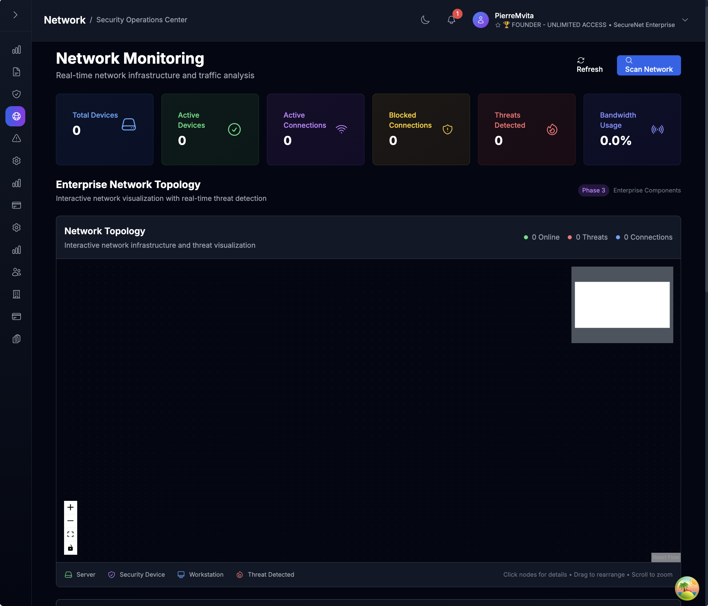

# 🔐 SecureNet

[](https://www.python.org/downloads/)
[](LICENSE.txt)
[](https://fastapi.tiangolo.com/)
[](tests/)
[](SECURITY.md)
[]()

> **AI-powered real-time network security monitoring and management system** with live WiFi network discovery, device monitoring, and comprehensive security management.

---

## 🚀 Quick Start

### Prerequisites
- **Python 3.8+** and **Node.js 18+**
- **Network access** for WiFi scanning and device discovery
- **Git** for cloning the repository

### Installation (3 minutes)
```bash
# 1. Clone repository
git clone https://github.com/pmvita/SecureNet.git && cd SecureNet

# 2. Setup backend with real network monitoring
python3 -m venv venv && source venv/bin/activate
pip install -r requirements.txt && python scripts/init_db.py

# 3. Setup frontend & start Enterprise mode
cd frontend && npm install && npm run Enterprise
```

**🎯 Ready!** Open `http://localhost:5173` 
- **Username**: `admin` | **Password**: `admin123`
- **Real Network Monitoring**: Automatically discovers your WiFi devices

> For detailed installation, see **[INSTALLATION.md](INSTALLATION.md)**

---

## ✨ Key Features

### 🔍 **Real-time Network Discovery**
- **Live WiFi scanning**: Discovers actual devices on your network (routers, endpoints, servers)
- **Device fingerprinting**: MAC address detection, port scanning, and device type classification
- **Network topology mapping**: Automatic subnet detection and range scanning
- **Cross-platform compatibility**: Native support for macOS, Linux, and Windows

### 📊 **Professional SOC Dashboard**  
- 6-panel security metrics with live network data
- Real device count and traffic monitoring
- Enterprise-grade visualizations with actual network statistics

### 🌐 **Advanced Network Management**
- **Real device monitoring**: Live discovery of network endpoints and infrastructure
- **Actual traffic analysis**: Real network traffic monitoring and bandwidth tracking
- **Device health monitoring**: Connection state tracking and availability monitoring
- **Multi-subnet support**: Automatic detection of network ranges (192.168.x.0/24, 10.x.x.0/24)

### 🔍 **Intelligent Device Detection**
- **Ping sweep scanning**: Fast discovery of responsive network devices
- **ARP table analysis**: MAC address resolution and vendor identification
- **Port scanning**: Service detection on discovered devices (HTTP, HTTPS, SSH, etc.)
- **Device classification**: Automatic categorization (Router, Server, Endpoint, Printer)

### 📝 **Comprehensive Log Management**
- ELK Stack/Splunk-style interface
- Real-time log streaming with WebSocket
- Advanced filtering and export capabilities

### 🔔 **Smart Alerting System**
- Real-time notifications with unread counters
- Slack and email integration
- Configurable alert thresholds

> **📖 See complete features:** **[FEATURES.md](FEATURES.md)**

---

## 🌟 Real Network Monitoring in Action

SecureNet discovers and monitors **your actual WiFi network**:

```
🌐 Network Discovery Results
├── 📍 192.168.2.1   - mynetwork (Router) - MAC: 44:E9:DD:4C:7C:74
├── 📱 192.168.2.17  - device-17 (Endpoint) - MAC: F0:5C:77:75:DD:F6  
├── 💻 192.168.2.28  - device-28 (Endpoint) - MAC: 26:29:45:1F:E5:2B
├── 📟 192.168.2.36  - device-36 (Endpoint) - MAC: E6:B3:48:2D:55:91
├── 🖥️  192.168.2.50  - device-50 (Endpoint) - MAC: 4A:D6:CC:65:97:8E
└── 📺 192.168.2.54  - device-54 (Endpoint) - Detected ports: 80, 443
```

**Live Traffic Monitoring**: Real-time bytes tracking, connection analysis, and network health metrics

---

## 📸 Screenshots

| Real Network Dashboard | Live Device Discovery | Security Monitoring |
|----------------------|---------------------|-------------------|
|  |  |  |

> **🖼️ View all screenshots:** **[SCREENSHOTS.md](SCREENSHOTS.md)**

---

## 📚 Documentation

| Document | Description |
|----------|-------------|
| **[🚀 INSTALLATION.md](INSTALLATION.md)** | Complete setup guide with network configuration |
| **[✨ FEATURES.md](FEATURES.md)** | Real network monitoring features documentation |
| **[📸 SCREENSHOTS.md](SCREENSHOTS.md)** | Visual guide and interface overview |
| **[🔧 FRONTEND-ARCHITECTURE.md](FRONTEND-ARCHITECTURE.md)** | Frontend development guide |
| **[📖 API-Reference.md](API-Reference.md)** | Complete API documentation |
| **[📋 TODO.md](TODO.md)** | Project roadmap and development status |
| **[🤝 CONTRIBUTING.md](CONTRIBUTING.md)** | Contribution guidelines |

---

## 🏗️ Architecture Overview

```
SecureNet/
├── 🐍 Backend (Python + FastAPI)     # Real-time API & WebSocket server
│   ├── 🌐 Network Scanner           # WiFi device discovery & monitoring
│   ├── 🔍 Device Detection          # Ping, ARP, port scanning
│   └── 📊 Traffic Analysis          # Real network traffic monitoring
├── ⚛️ Frontend (React + TypeScript)   # Modern SOC interface
├── 💾 Database (SQLite)              # Live device & traffic storage
├── 🤖 ML Engine (scikit-learn)       # Anomaly detection
└── 🔔 Alerting (Slack + Email)       # Notification system
```

**Development Modes:**
- **🚀 Mock Mode**: `npm run dev` (Sample data for development)
- **🌐 Enterprise Mode**: `npm run Enterprise` (Live network monitoring)

---

## 🛠️ Tech Stack

### Backend Network Monitoring
- **FastAPI** - High-performance async API framework
- **psutil** - Cross-platform network interface detection
- **Ping/ARP scanning** - Native network discovery tools
- **Socket programming** - Port scanning and device detection
- **SQLite** - Real-time device and traffic data storage

### Frontend  
- **React 18** + **TypeScript** - Modern UI framework
- **Vite** - Lightning-fast development server
- **Tailwind CSS** - Utility-first styling
- **React Query** - Live data fetching and caching
- **WebSocket** - Real-time network updates

---

## 🎯 Use Cases

### 🏢 **Enterprise Network Security**
- **Real WiFi monitoring** for corporate networks
- **Device inventory management** with automatic discovery
- **Rogue device detection** and network access control

### 🌐 **Home Network Management**
- **Personal WiFi monitoring** and device tracking
- **Bandwidth analysis** and traffic monitoring
- **IoT device discovery** and security assessment

### 📊 **IT Operations**
- **Network asset discovery** and inventory management
- **Real-time connectivity monitoring** and health checks
- **Automated device alerting** and notifications

---

## 🚦 Project Status

### ✅ **Production Ready**
- **Real Network Discovery** - Live WiFi device scanning
- **Device Monitoring** - Actual network endpoint tracking
- **Traffic Analysis** - Real network traffic monitoring
- Professional SOC Dashboard with live data
- Enhanced Navigation System

### 🚧 **In Development**
- Advanced Network Analytics Dashboard
- Cloud Integration (AWS, Azure, GCP)
- GPT-based Security Analysis

### 📋 **Planned**
- **Network Vulnerability Scanning**
- **Advanced Device Fingerprinting**
- **Zero-trust Security Model**
- Mobile Application

> **📋 Full roadmap:** **[TODO.md](TODO.md)**

---

## 🔒 Security & Compliance

- **🔐 Encrypted data handling** with secure API authentication
- **🌐 Network scanning permissions** with proper privilege management
- **📊 Audit logging** for all network scans and device discoveries
- **🔄 Secure device data storage** with privacy considerations

### Network Scanning Permissions
SecureNet requires appropriate network permissions for device discovery:
- **macOS**: May require administrator privileges for comprehensive scanning
- **Linux**: Root access recommended for full network access
- **Windows**: Administrator rights for network interface access

---

## 🤝 Contributing

We welcome contributions! SecureNet is built with modern technologies and focuses on real network monitoring capabilities.

**Quick Contribution Guide:**
1. Fork the repository
2. Set up real network testing environment
3. Create a feature branch
4. Test with actual network devices
5. Submit a pull request

> **📖 Detailed guide:** **[CONTRIBUTING.md](CONTRIBUTING.md)**

---

## 📞 Support & Contact

- **📧 Email**: [petermvita@hotmail.com](mailto:petermvita@hotmail.com)
- **🐛 Issues**: [GitHub Issues](https://github.com/pmvita/SecureNet/issues)  
- **💬 Discussions**: [GitHub Discussions](https://github.com/pmvita/SecureNet/discussions)
- **📚 Wiki**: [Project Documentation](https://github.com/pmvita/SecureNet/wiki)

---

**⚡ SecureNet: Real Network Monitoring Made Simple** - Transform your network visibility with live device discovery and intelligent security monitoring. 