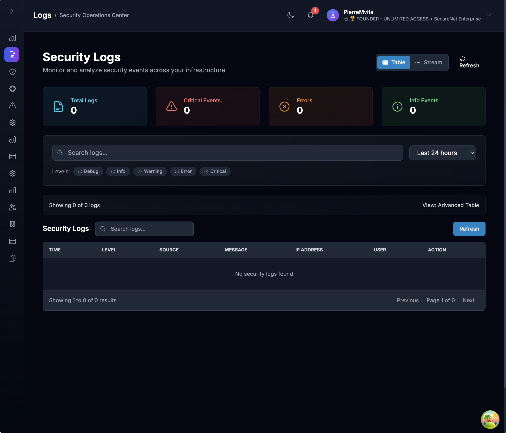
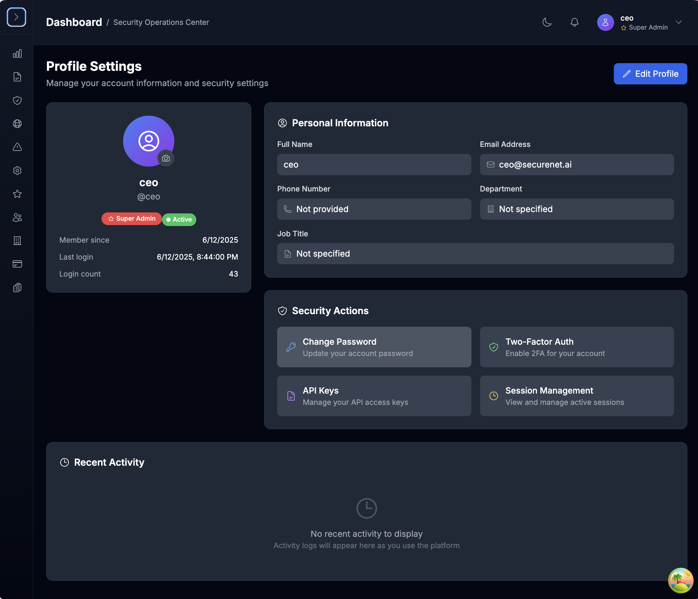

# 📸 SecureNet Screenshots & Visual Guide

> Visual overview of SecureNet's security monitoring and management interface

## 🔐 Authentication

*Secure login interface with:*
- Username and password authentication
- Clean, professional design
- Security-focused branding
- Responsive layout for all devices

---

## 📊 Dashboard Overview

*Comprehensive Security Operations Center (SOC) dashboard featuring:*

#### Real-time Security Metrics
- **Security score tracking** with trend analysis
- **Active threats monitoring** with severity indicators
- **Network health visualization** with status metrics
- **Asset protection status** with comprehensive monitoring
- **Service status indicators** for system components
- **Real-time data updates** via WebSocket connections

#### Professional Interface Elements
- **6-panel metrics display** with gradient-based design system
- **Interactive visualizations** using Chart.js
- **Color-coded status indicators** for quick assessment
- **Quick action buttons** for immediate response
- **Responsive grid layout** optimized for all screen sizes

---

## 📝 Log Management

*Professional log management system (ELK Stack/Splunk style) featuring:*

#### Real-time Log Streaming
- **Live log streaming** with WebSocket support
- **Color-coded log levels** for easy identification (DEBUG, INFO, WARNING, ERROR, CRITICAL)
- **Expandable log entries** for detailed inspection
- **Real-time filtering** and search capabilities
- **Pause/Resume functionality** for controlled monitoring

#### Advanced Log Analysis
- **Advanced filtering and search** with regex support
- **Log source management** and monitoring
- **Export functionality** for analysis (CSV, JSON, PDF)
- **Log statistics** and trend visualization
- **Source health metrics** and status tracking

#### Professional Features
- **Interactive log feed** with smooth scrolling
- **Multiple log source types**: Syslog, File, API, Database
- **Flexible log format support**: Auto-detect, JSON, Syslog, CSV
- **Tag-based organization** for efficient management

---

## 🔒 Security Management

*Enhanced security management center featuring:*

#### Real-time Security Scanning
- **Security scan management** with real-time progress monitoring
- **Multiple scan types**: Full system, vulnerability, compliance, and custom scans
- **Scan scheduling** with datetime support and automated workflows
- **Detailed findings management** with severity-based categorization
- **Finding status tracking** and resolution workflows
- **Interactive scan dashboard** with charts and statistics

#### Advanced Security Features
- **Threat detection visualization** with ML insights
- **Anomaly analysis interface** with interactive timeline charts
- **Security incident tracking** with detailed investigation tools
- **Export capabilities** for scan results and findings
- **WebSocket-based real-time updates** for live monitoring

---

## 🌐 Network Monitoring

*Comprehensive network monitoring center featuring:*

#### Live Network Traffic Monitoring (Wireshark-style)
- **Real-time packet-level analysis** with live data streaming
- **Professional traffic logs** with source/destination IPs, ports, protocols
- **Advanced filtering** by protocol, security status, and applications
- **Traffic statistics dashboard** with real-time counters
- **Play/pause controls** with configurable refresh intervals

#### Professional Device Management
- **Network device discovery** with enhanced status tracking
- **Real-time device health monitoring** with professional indicators
- **Interactive device details** with comprehensive information
- **Device performance metrics** with latency and bandwidth tracking

#### Enhanced Network Features
- **Geographic tracking** with country code identification
- **Protocol analysis** with color-coded visualization
- **Connection management** with real-time state updates
- **Network topology visualization** with device health monitoring
- **Performance trend tracking** with enterprise-grade charts
- **Native macOS network monitoring** with `netstat` integration

---

## ⚙️ Settings & Configuration

*Configuration management interface featuring:*

#### System Configuration
- **Log source configuration** and management
- **Notification settings** and preferences
- **API key management** with secure generation
- **System preferences** and user management

#### Advanced Network Configuration
- **Network interface selection** (auto-detect, ethernet, WiFi, all interfaces)
- **IP range monitoring** with CIDR notation support
- **Device discovery methods** (ping+ARP, ping-only, ARP-only, passive)
- **Traffic analysis and packet capture** settings
- **DNS monitoring** and port scan detection configuration
- **Bandwidth threshold alerting** with customizable limits
- **Packet capture filtering** with BPF expressions
- **Maximum device tracking limits** for performance optimization

#### Security & Alert Configuration
- **Security scan configuration** with customizable parameters
- **Alert threshold configuration** for proactive monitoring
- **Export/Import settings** for backup and restore
- **Comprehensive settings UI** with validation and descriptions

---

## ⭐️ Admin Dashboard

*Admin dashboard interface featuring:*

#### Comprehensive Dashboard
- **Real-time system status** with live updates
- **Security score tracking** with trend analysis
- **Network topology visualization** with device health monitoring
- **Real-time data updates** via WebSocket connections
- **User management** and role-based access control

---

## 👥 User Management

*User management interface featuring:*

#### User Management
- **User profile creation** and management
- **User role assignment** with access permissions
- **Password management** with secure storage
- **User preferences** and notification settings

---

## 👤 Profile Settings

*Profile management interface featuring:*

#### User Management
- **User profile creation** and management
- **User role assignment** with access permissions
- **Password management** with secure storage
- **User preferences** and notification settings

---

## ⚙️ Preferences

*Preferences management interface featuring:*

#### User Preferences
- **User interface customization** with theme selection
- **Notification settings** and preferences
- **Language support** and localization

---

## 🚨 Anomaly Detection

### Anomaly Analysis Interface
*Advanced anomaly detection featuring:*

#### ML-Powered Insights
- **Interactive timeline charts** for anomaly visualization
- **Severity distribution analysis** with color-coding
- **Real-time anomaly updates** via WebSocket
- **Advanced filtering and search** capabilities
- **Detailed anomaly inspection** with ML insights

#### Professional Analysis Tools
- **Trend analysis and statistics** for pattern recognition
- **Export capabilities** for further analysis
- **False positive management** and resolution workflows
- **Anomaly correlation** with security events

---

## 📱 Mobile & Responsive Design

### Mobile-Optimized Interface
*All interfaces are fully responsive and mobile-friendly:*

#### Mobile Features
- **Touch-friendly interactions** for mobile devices
- **Responsive navigation** with collapsible sidebar
- **Mobile-optimized charts** and visualizations
- **Gesture support** for intuitive navigation
- **Optimized performance** for mobile networks

#### Cross-Platform Compatibility
- **iOS Safari** support with native touch gestures
- **Android Chrome** optimization for performance
- **Tablet layouts** with enhanced screen real estate
- **Desktop** full-featured experience

---

## 🎨 Design System

### Professional UI Elements

#### Visual Design Language
- **Gradient-based design system** with consistent styling
- **Professional color palette** with security-focused themes
- **Modern typography** with excellent readability
- **Consistent spacing** and layout patterns

#### Interactive Components
- **Smooth animations** and transitions
- **Hover effects** and visual feedback
- **Loading states** and skeletons
- **Error handling** with user-friendly messages

#### Navigation System
- **Modern collapsible sidebar** with gradient backgrounds
- **Heroicons integration** with professional icon mapping
- **Interactive search functionality** within navigation
- **Real-time notification system** with unread counters
- **Advanced user menu** with profile management

---

## 🔧 Development Tools

### Storybook Component Library
*Component development and documentation:*
- **Interactive component playground**
- **Component documentation** with usage examples
- **Design system showcase**
- **Accessibility testing** tools

### Developer Experience
- **TypeScript integration** for type safety
- **Hot module replacement** for fast development
- **Comprehensive testing** with Jest and Testing Library
- **ESLint and Prettier** for code quality

---

## 📊 Real-time Features

### Live Data Streaming
*All interfaces support real-time updates:*
- **WebSocket connections** for live data
- **Automatic refresh** with configurable intervals
- **Real-time notifications** and alerts
- **Live status indicators** throughout the interface

### Performance Monitoring
- **Real-time metrics** for system performance
- **Live traffic monitoring** with packet-level detail
- **Instant security alerts** with immediate notifications
- **Dynamic data visualization** with smooth updates

---

*Screenshots are automatically updated with each release to reflect the latest features and improvements.*

For more detailed feature information, see [FEATURES.md](FEATURES.md)
For installation instructions, see [INSTALLATION.md](INSTALLATION.md)
For API documentation, see [API-Reference.md](API-Reference.md) 