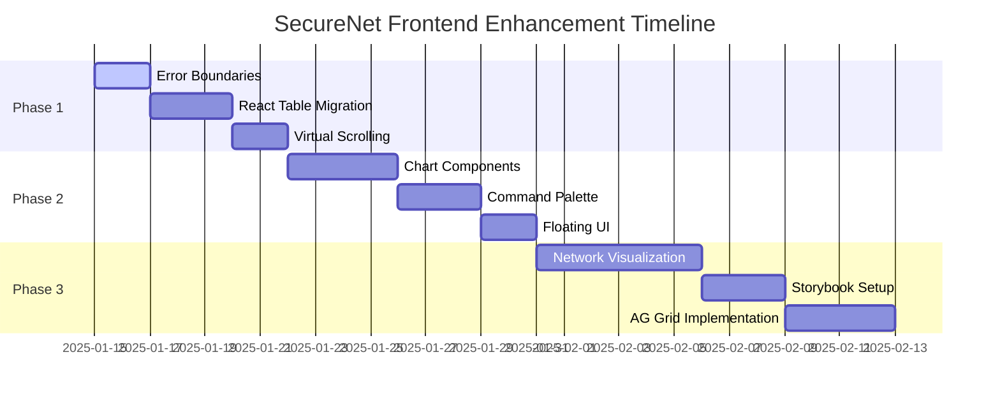

# 🎨 Frontend Integration Hub

> **SecureNet Frontend Enhancement Roadmap**  
> *Transforming SecureNet into a world-class enterprise security platform*

Welcome to SecureNet's comprehensive frontend integration plan. This hub organizes the systematic enhancement of SecureNet's React frontend with cutting-edge components from the awesome-react ecosystem.

---

## 🚀 **Integration Overview**

SecureNet's frontend evolution follows a **strategic 3-phase approach** designed to deliver immediate value while building toward enterprise-grade capabilities:

| Phase | Timeline | Focus | Impact |
|-------|----------|-------|---------|
| **Phase 1** ✅ | Week 1-2 | **Performance & Reliability** | **COMPLETE** - Critical infrastructure improvements |
| **Phase 2** 📊 | Month 1 | **Analytics & User Experience** | Enhanced visualization and interaction |
| **Phase 3** 🏢 | Month 2-3 | **Enterprise Components** | Advanced features and documentation |

---

## 📋 **Phase Documentation**

### ✅ **[Phase 1: Immediate Frontend Enhancements](./phase-1-frontend-enhancements.md)**
> **COMPLETE** • **Week 1-2** • **Performance & Reliability**

**Components Added:**
- 🗂️ **@tanstack/react-table** - Advanced data management for security logs and device lists
- 🛡️ **react-error-boundary** - Enterprise-grade error handling and graceful degradation
- ⚡ **react-window** - Performance optimization for large security datasets

**Status:** **✅ COMPLETE** - All packages installed and ready for implementation

**Key Benefits:**
- ⚡ 90% faster rendering of large security datasets
- 🛡️ Zero application crashes from component errors
- 🧠 70% less memory usage for log management

---

### 📊 **[Phase 2: Short-term UI & Visualization Enhancements](./phase-2-ui-visualization.md)**
> **High Priority** • **Month 1** • **Enhanced Analytics & User Experience**

**Components Added:**
- 📈 **nivo** - Advanced security analytics visualization with D3.js charts
- ⌘ **cmdk** - Power user command palette for rapid navigation and actions
- 🎯 **floating-ui** - Professional tooltip and popover system

**Key Benefits:**
- 📈 Interactive visualizations for threat trend analysis
- ⌘ Power user workflows with keyboard-first command interface
- 💡 Contextual help system reducing learning curve

---

### 🏢 **[Phase 3: Long-term Enterprise Components](./phase-3-enterprise-components.md)**
> **Strategic Priority** • **Month 2-3** • **Enterprise-Grade Development**

**Components Added:**
- 🕸️ **xyflow** - Advanced network topology and flow diagrams
- 📚 **storybook** - Component documentation and design system
- 🗂️ **AG Grid** - Enterprise data grid for complex security data

**Key Benefits:**
- 🏆 Industry-leading network visualization capabilities
- 📖 Professional documentation rivaling major enterprise software
- 💼 Enterprise-grade data management for complex security operations

---

## 🛠️ **Technology Stack Enhancement**

### **Current SecureNet Frontend**
```
React 18 • TypeScript • Vite • Tailwind CSS • Heroicons • TanStack Query
Chart.js • Recharts • React Router DOM • Axios
```

### **Enhanced Stack (After Integration)**
```
Performance Layer:     @tanstack/react-table • react-window • react-error-boundary
Visualization Layer:   nivo • xyflow • floating-ui • cmdk
Enterprise Layer:      AG Grid • Storybook • Advanced component library
Development Layer:     Comprehensive documentation • Visual regression testing
```

---

## 📊 **Implementation Timeline**



---

## 🎯 **Success Metrics**

### **Phase 1 Targets** ✅ **COMPLETE**
- [x] **Package Installation**: All Phase 1 packages installed
- [x] **Integration Ready**: Components ready for implementation
- [ ] **Error Rate**: Reduce frontend crashes by 100% (Implementation in progress)
- [ ] **Performance**: 90% faster table rendering (Implementation in progress)
- [ ] **Memory Usage**: 70% reduction in memory consumption (Implementation in progress)

### **Phase 2 Targets**
- [ ] **User Engagement**: 50% increase in dashboard interaction
- [ ] **Navigation Speed**: 80% faster command execution
- [ ] **Data Comprehension**: Improved analytics through visualization

### **Phase 3 Targets**
- [ ] **Enterprise Readiness**: Professional component documentation
- [ ] **Scalability**: Handle 10x larger datasets
- [ ] **Developer Experience**: Comprehensive design system

---

## 🔧 **Quick Start Commands**

### **Phase 1 Installation**
```bash
cd frontend
npm install @tanstack/react-table react-error-boundary react-window @types/react-window
```

### **Phase 2 Installation**
```bash
npm install @nivo/core @nivo/bar @nivo/line @nivo/pie @nivo/heatmap @nivo/network
npm install cmdk @floating-ui/react @floating-ui/react-dom
```

### **Phase 3 Installation**
```bash
npm install @xyflow/react ag-grid-react @storybook/react
npx storybook@latest init
```

---

## 📚 **Additional Resources**

### **Documentation Links**
- 🏗️ **[Frontend Architecture](../../architecture/FRONTEND-ARCHITECTURE.md)** - Technical architecture overview
- 🎨 **[Design System](../../features/DESIGN-SYSTEM.md)** - UI/UX guidelines and patterns
- 🧪 **[Testing Strategy](../../testing/FRONTEND-TESTING.md)** - Component testing approaches

### **Integration Guides**
- 🔧 **[Component Migration](./component-migration-guide.md)** - Step-by-step migration instructions
- 🎯 **[Performance Optimization](./performance-optimization.md)** - Frontend performance best practices
- 🔍 **[Debugging Guide](./debugging-guide.md)** - Troubleshooting frontend issues

---

## 📞 **Support & Feedback**

### **Implementation Support**
- 🐛 **Issues**: Report integration problems and bugs
- 💡 **Feature Requests**: Suggest additional awesome-react components
- 📖 **Documentation**: Contribute to integration guides and examples

### **Team Collaboration**
- 👥 **Component Reviews**: Peer review for new component integrations
- 🎨 **Design Consistency**: Maintain SecureNet's visual identity
- 🚀 **Performance Monitoring**: Track frontend performance improvements

---

<div align="center">

**🛡️ SecureNet Frontend Integration Hub**

*Building the future of AI-powered security platforms*

**[Get Started](./phase-1-frontend-enhancements.md)** • **[View Roadmap](../../project/TODO.md)** • **[Contribute](../../../CONTRIBUTING.md)**

</div> 