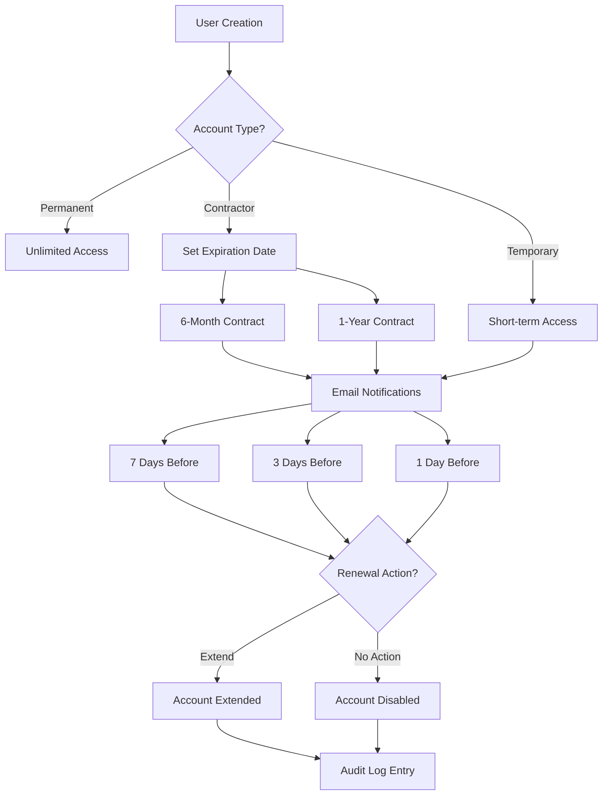
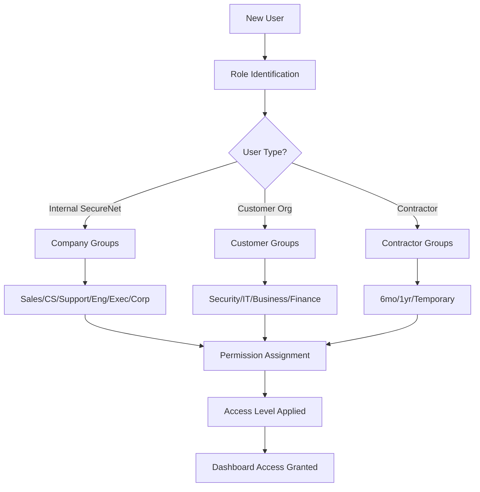

# SecureNet Enterprise: User Management & Access Control

> **Comprehensive User Groups & Account Management Guide**  
> *Enterprise-Grade User Management for Cybersecurity SaaS Platform*

---

## 🎯 **Overview**

SecureNet Enterprise provides sophisticated user management capabilities designed for complex organizational structures typical in cybersecurity operations. This document details all user types, groups, permissions, and account management features available in the platform.

### **Key Features**
- **🏢 User Groups Management**: Organize users into logical groups with inherited permissions
- **⏰ Account Expiration**: Automated lifecycle management for contractors and temporary users
- **🔐 Role-Based Access Control**: 5-tier access levels with granular permissions
- **📊 Enterprise Dashboard**: Comprehensive user management and monitoring interface
- **🔄 Bulk Operations**: Mass user management and account extension capabilities

---

## 🏢 **INTERNAL SECURENET COMPANY USERS**

### **Sales Team**
**Purpose**: Drive revenue growth and customer acquisition for SecureNet platform

| Role | Responsibilities | Access Level | Account Type |
|------|-----------------|--------------|--------------|
| **Sales Development Rep (SDR)** | Lead qualification, prospecting, initial outreach | Business | Permanent |
| **Account Executive (AE)** | Deal closure, customer relationships, contract negotiation | Business | Permanent |
| **Sales Engineer (SE)** | Technical demonstrations, solution architecture, POCs | IT Ops | Permanent |
| **Sales Director** | Team management, forecasting, strategic planning | Platform Admin | Permanent |
| **Channel Partners** | Partner relationships, channel sales, reseller management | External | 1-Year Contract |

**Group Permissions:**
- Access to customer prospect data and sales pipeline
- CRM integration and lead management tools
- Product demonstration capabilities and demo environments
- Sales analytics and performance dashboards
- Customer communication and support ticket visibility

---

### **Customer Success Team**
**Purpose**: Ensure customer satisfaction, retention, and platform adoption

| Role | Responsibilities | Access Level | Account Type |
|------|-----------------|--------------|--------------|
| **Customer Success Manager (CSM)** | Account health, relationship management, expansion | Business | Permanent |
| **Customer Success Engineer** | Technical onboarding, implementation support | IT Ops | Permanent |
| **Onboarding Specialist** | New customer setup, training, initial configuration | Business | Permanent |
| **Renewal Manager** | Contract renewals, upselling, retention strategies | Business | Permanent |

**Group Permissions:**
- Customer health scores and analytics
- Support ticket management and escalation
- Product usage analytics and adoption metrics
- Customer communication tools and documentation
- Billing and subscription management (read-only)

---

### **Support Team**
**Purpose**: Provide technical assistance and resolve customer issues

| Role | Responsibilities | Access Level | Account Type |
|------|-----------------|--------------|--------------|
| **Tier 1 Support** | Basic troubleshooting, ticket triage, documentation | Business | Permanent |
| **Tier 2 Support** | Advanced troubleshooting, escalation handling | IT Ops | Permanent |
| **Tier 3 Support** | Expert-level issues, engineering escalation | Security Ops | Permanent |
| **Technical Support Engineer** | Complex integrations, API support, customizations | Security Ops | Permanent |
| **Support Operations** | Process improvement, tools management, metrics | IT Ops | Permanent |

**Group Permissions:**
- Full customer support ticket access
- System logs and diagnostic tools
- Customer environment access (with approval)
- Knowledge base management and documentation
- Escalation to engineering teams

---

### **Engineering Team**
**Purpose**: Develop, maintain, and enhance the SecureNet platform

| Role | Responsibilities | Access Level | Account Type |
|------|-----------------|--------------|--------------|
| **Frontend Engineer** | UI/UX development, client-side functionality | Security Ops | Permanent |
| **Backend Engineer** | API development, database design, server logic | Security Ops | Permanent |
| **DevOps/SRE Engineer** | Infrastructure, deployment, monitoring, scaling | Platform Admin | Permanent |
| **Security Engineer** | Security features, compliance, vulnerability management | Platform Admin | Permanent |
| **ML/AI Engineer** | Machine learning models, threat detection algorithms | Security Ops | Permanent |

**Group Permissions:**
- Full platform development access
- Production system monitoring and debugging
- Database access and schema management
- CI/CD pipeline management
- Security scanning and vulnerability tools

---

### **Executive Team**
**Purpose**: Strategic leadership and organizational oversight

| Role | Responsibilities | Access Level | Account Type |
|------|-----------------|--------------|--------------|
| **CEO** | Company vision, strategy, investor relations | Platform Admin | Permanent |
| **CTO** | Technology strategy, engineering leadership | Platform Admin | Permanent |
| **VP Sales** | Sales organization, revenue strategy | Business | Permanent |
| **VP Marketing** | Brand, demand generation, market positioning | Business | Permanent |
| **VP Customer Success** | Customer experience, retention, expansion | Business | Permanent |
| **VP Engineering** | Product development, technical leadership | Platform Admin | Permanent |

**Group Permissions:**
- Executive dashboards and business intelligence
- Company-wide analytics and performance metrics
- Financial reporting and revenue analytics
- Strategic planning tools and forecasting
- High-level system health and security overview

---

### **Corporate Functions**
**Purpose**: Support business operations and compliance

| Role | Responsibilities | Access Level | Account Type |
|------|-----------------|--------------|--------------|
| **Finance/Accounting** | Billing, invoicing, financial reporting | Business | Permanent |
| **Human Resources** | Employee management, recruitment, compliance | Business | Permanent |
| **Legal/Compliance** | Contracts, regulatory compliance, risk management | Business | Permanent |
| **Operations** | Process optimization, vendor management | Business | Permanent |

**Group Permissions:**
- Financial dashboards and billing information
- Employee access management (HR only)
- Compliance reporting and audit trails
- Vendor and contract management tools
- Company policy and procedure access

---

## 🏢 **CUSTOMER ORGANIZATION USERS**

### **Security Teams**
**Purpose**: Manage cybersecurity operations and threat response

| Role | Responsibilities | Access Level | Account Type |
|------|-----------------|--------------|--------------|
| **SOC Analyst Tier 1** | Initial threat analysis, alert triage | Business | Permanent |
| **SOC Analyst Tier 2** | Advanced investigation, incident escalation | Security Ops | Permanent |
| **SOC Analyst Tier 3** | Expert analysis, threat hunting, forensics | Security Ops | Permanent |
| **CISO** | Security strategy, risk management, compliance | Platform Admin | Permanent |
| **Security Director** | Team leadership, process management | Security Ops | Permanent |
| **Incident Response** | Emergency response, breach containment | Security Ops | Permanent |

**Group Permissions:**
- Real-time threat detection and monitoring
- Security event analysis and investigation tools
- Incident response workflows and playbooks
- Threat intelligence and IOC management
- Compliance reporting and audit capabilities

---

### **IT Operations**
**Purpose**: Manage technology infrastructure and system operations

| Role | Responsibilities | Access Level | Account Type |
|------|-----------------|--------------|--------------|
| **CIO** | IT strategy, technology leadership | Platform Admin | Permanent |
| **Network Engineer** | Network security, configuration management | IT Ops | Permanent |
| **System Administrator** | Server management, user provisioning | IT Ops | Permanent |
| **IT Help Desk** | End-user support, basic troubleshooting | Business | Permanent |

**Group Permissions:**
- Network monitoring and device management
- System configuration and user management
- IT asset tracking and inventory
- Network topology and performance analytics
- Basic security monitoring and alerting

---

### **Business Stakeholders**
**Purpose**: Oversight and strategic decision-making

| Role | Responsibilities | Access Level | Account Type |
|------|-----------------|--------------|--------------|
| **Executives** | Strategic oversight, budget approval | Business | Permanent |
| **Compliance Officer** | Regulatory compliance, audit management | Business | Permanent |
| **Risk Manager** | Risk assessment, mitigation strategies | Business | Permanent |
| **Audit Director** | Internal/external audit coordination | Business | Permanent |

**Group Permissions:**
- Executive security dashboards and KPIs
- Compliance status and reporting
- Risk assessment tools and metrics
- Audit trails and documentation access
- High-level security posture visibility

---

### **Financial Contacts**
**Purpose**: Manage procurement and financial aspects

| Role | Responsibilities | Access Level | Account Type |
|------|-----------------|--------------|--------------|
| **IT Finance** | Technology budget, cost management | Business | Permanent |
| **Procurement** | Vendor selection, contract negotiation | Business | Permanent |
| **Accounts Payable** | Invoice processing, payment management | Business | Permanent |
| **Contract Management** | Contract lifecycle, renewals | Business | Permanent |

**Group Permissions:**
- Billing and usage analytics
- Cost optimization recommendations
- Contract and subscription management
- Vendor performance and SLA tracking
- Financial reporting and forecasting

---

## 🔐 **CONTRACTOR & TEMPORARY ACCESS**

### **6-Month Contracts**
**Purpose**: Specialized short-term security expertise

| Role | Use Cases | Access Level | Account Features |
|------|-----------|--------------|------------------|
| **Penetration Tester** | Security assessments, vulnerability testing | Security Ops | Auto-expiry, Limited scope |
| **Security Consultant** | Specialized implementations, compliance projects | Security Ops | Auto-expiry, Project-based |

**Account Management:**
- **Duration**: 6 months from creation date
- **Notifications**: Email alerts at 7, 3, and 1 days before expiration
- **Extension**: Manager approval required for renewal
- **Access Scope**: Limited to specific projects and data sets

---

### **1-Year Contracts**
**Purpose**: Extended project work and long-term consulting

| Role | Use Cases | Access Level | Account Features |
|------|-----------|--------------|------------------|
| **Project Security Engineer** | Large implementations, system integrations | Security Ops | Annual renewal, Extended scope |
| **Long-term Consultant** | Strategic initiatives, transformation projects | IT Ops | Annual renewal, Broad access |

**Account Management:**
- **Duration**: 12 months from creation date
- **Notifications**: Email alerts at 30, 14, and 7 days before expiration
- **Extension**: Automatic renewal with contract approval
- **Access Scope**: Broader access based on project requirements

---

### **Temporary Access (30-90 days)**
**Purpose**: Short-term emergency or audit access

| Role | Use Cases | Access Level | Account Features |
|------|-----------|--------------|------------------|
| **External Auditor** | Compliance audits, security assessments | Business | Limited duration, Audit trail |
| **Emergency Responder** | Incident response, crisis management | Security Ops | Emergency access, Time-limited |
| **Vendor Support** | Technical support, maintenance windows | IT Ops | Specific timeframe, Supervised |

**Account Management:**
- **Duration**: 30-90 days based on need
- **Notifications**: Daily alerts in final week
- **Extension**: Emergency extension up to 30 additional days
- **Access Scope**: Highly restricted, activity monitored

---

## 🔐 **ACCESS LEVELS & PERMISSIONS**

### **5-Tier Access Control System**

#### **1. Platform Admin (Highest)**
- **Users**: CTO, Security Engineers, DevOps/SRE, CISO
- **Permissions**: Full platform access, user management, system configuration
- **Restrictions**: Audit logging, approval workflows for critical changes

#### **2. Security Ops**
- **Users**: SOC Analysts T2/T3, Security Engineers, Incident Response
- **Permissions**: Security tools, threat analysis, incident management
- **Restrictions**: No user management, limited system configuration

#### **3. IT Ops**
- **Users**: Network Engineers, System Admins, Customer Success Engineers
- **Permissions**: Network monitoring, device management, user support
- **Restrictions**: No security policy changes, limited sensitive data access

#### **4. Business**
- **Users**: Sales, Customer Success, Support T1, Business Stakeholders
- **Permissions**: Business dashboards, customer data, reporting tools
- **Restrictions**: No system configuration, limited technical access

#### **5. External (Lowest)**
- **Users**: Channel Partners, Contractors, Temporary Users
- **Permissions**: Limited scope based on role and contract
- **Restrictions**: Heavy monitoring, time-limited access, approval workflows

---

## 📊 **USER MANAGEMENT FEATURES**

### **User Groups Management**
- **Create Groups**: Define custom groups with specific permissions
- **Assign Users**: Bulk assignment and individual user management
- **Permission Inheritance**: Automatic permission assignment based on group membership
- **Group Hierarchies**: Parent-child relationships with permission inheritance
- **Dynamic Groups**: Automatic assignment based on user attributes

### **Account Expiration System**
- **Automated Monitoring**: Daily background job checks all account expiration dates
- **Notification System**: Email alerts at 30, 14, 7, 3, and 1 days before expiration
- **Grace Period**: 7-day grace period with limited access after expiration
- **Bulk Extensions**: Mass account renewal for multiple users
- **Audit Trail**: Complete logging of all account lifecycle events

### **Enhanced User Creation**
- **Account Type Selection**: Permanent, Contractor (6mo/1yr), Temporary (30-90 days)
- **Automatic Expiration**: Calculate expiration dates based on account type
- **Group Assignment**: Automatic group membership based on role and organization
- **Approval Workflows**: Manager approval for contractor and temporary accounts
- **Welcome Automation**: Automated onboarding and initial setup

### **Enterprise Dashboard**
- **Expiration Monitoring**: Visual timeline of upcoming account expirations
- **User Groups Overview**: Group membership statistics and permission analysis
- **Access Analytics**: User activity tracking and access pattern analysis
- **Compliance Reporting**: Account status and audit trail generation
- **Bulk Operations**: Mass user management and account maintenance

---

## 🔄 **WORKFLOW & AUTOMATION**

### **Account Lifecycle Management**

### **User Group Assignment Flow**

---

## 🛡️ **SECURITY & COMPLIANCE**

### **Security Features**
- **Multi-Factor Authentication**: Required for all Platform Admin and Security Ops users
- **Session Management**: Automatic timeout and concurrent session limits
- **Device Fingerprinting**: Detection of new devices and suspicious logins
- **Audit Logging**: Complete trail of all user actions and administrative changes
- **Access Reviews**: Quarterly review of user permissions and group memberships

### **Compliance Standards**
- **SOC 2 Type II**: User access controls and periodic review requirements
- **ISO 27001**: Information security management and access control procedures
- **GDPR**: User data protection and right to access/deletion
- **HIPAA**: Healthcare data access controls (for healthcare customers)
- **FedRAMP**: Government security requirements (for federal customers)

### **Data Protection**
- **Encryption at Rest**: All user data encrypted using AES-256
- **Encryption in Transit**: TLS 1.3 for all communications
- **Data Minimization**: Users only access data required for their role
- **Geographic Restrictions**: Location-based access controls available
- **Data Retention**: Automatic user data cleanup based on retention policies

---

## 🚀 **IMPLEMENTATION ROADMAP**

### **Phase 1: Core User Groups (Week 4 Day 4)**
- [ ] Database schema for user_groups and user_group_memberships
- [ ] User Groups CRUD API endpoints
- [ ] Basic group assignment functionality
- [ ] Permission inheritance system

### **Phase 2: Account Expiration (Week 4 Day 4)**
- [ ] Account expiration database fields
- [ ] Automated expiration checking background job
- [ ] Email notification system
- [ ] Enhanced user creation with expiration options

### **Phase 3: Management Interface (Week 4 Day 5)**
- [ ] User Groups management dashboard
- [ ] Expiration monitoring interface
- [ ] Bulk user operations
- [ ] Enhanced user profiles with group/expiration info

### **Phase 4: Advanced Features (Week 5)**
- [ ] Dynamic group assignment rules
- [ ] Advanced permission management
- [ ] Compliance reporting automation
- [ ] Integration with enterprise directory services

---

## 📚 **Related Documentation**

| Document | Description | Link |
|----------|-------------|------|
| **Production Launch Roadmap** | Strategic implementation plan | [📋 Roadmap](../project/PRODUCTION_LAUNCH_ROADMAP.md) |
| **Sprint Planning Guide** | Daily implementation tasks | [📅 Sprint Planning](../project/SPRINT_PLANNING.md) |
| **Production Launch Checklist** | Validation criteria | [✅ Checklist](../setup/PRODUCTION_LAUNCH_CHECKLIST.md) |
| **Enhanced Features Guide** | Platform capabilities overview | [🚀 Features](./ENHANCED_FEATURES.md) |
| **API Documentation** | Technical API reference | [🔧 API Docs](../api/API-DOCUMENTATION.md) |

---

## 📞 **Support & Contact**

For questions about user management implementation or enterprise requirements:

- **Technical Implementation**: Engineering Team
- **Security & Compliance**: Security Engineering Team  
- **Business Requirements**: Customer Success Team
- **Documentation Updates**: Technical Writing Team

---

*This document is part of the SecureNet Enterprise Production Launch documentation suite. Last updated: December 2024*
|----------|-------------|------|
| **Production Launch Roadmap** | Strategic implementation plan | [📋 Roadmap](../project/PRODUCTION_LAUNCH_ROADMAP.md) |
| **Sprint Planning Guide** | Daily implementation tasks | [📅 Sprint Planning](../project/SPRINT_PLANNING.md) |
| **Production Launch Checklist** | Validation criteria | [✅ Checklist](../setup/PRODUCTION_LAUNCH_CHECKLIST.md) |
| **Enhanced Features Guide** | Platform capabilities overview | [🚀 Features](./ENHANCED_FEATURES.md) |
| **API Documentation** | Technical API reference | [🔧 API Docs](../api/API-DOCUMENTATION.md) |

---

## 📞 **Support & Contact**

For questions about user management implementation or enterprise requirements:

- **Technical Implementation**: Engineering Team
- **Security & Compliance**: Security Engineering Team  
- **Business Requirements**: Customer Success Team
- **Documentation Updates**: Technical Writing Team

---

*This document is part of the SecureNet Enterprise Production Launch documentation suite. Last updated: December 2024* 